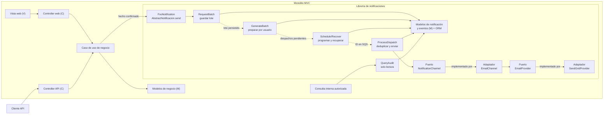
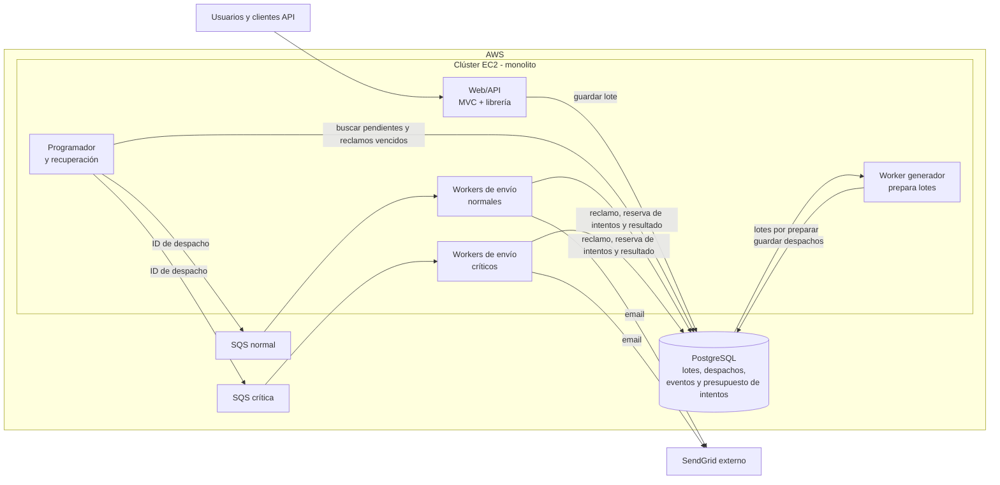

# 📬 Mini central de notificaciones — documento técnico

Este documento presenta el diseño técnico para la **mini central de notificaciones y un filtro inicial de mensajes duplicados del caso Buk – SE**. Su objetivo es que equipos de ingeniería y otras personas involucradas puedan entender la propuesta, evaluar sus riesgos y comprobar si cumple los requisitos.

**🎯 Alcance:** definir una notificación mediante `title` y `body`, registrar cada solicitud para uno o varios usuarios mediante `FooNotification.send(user_ids: [...])`, evitar que despachos duplicados lleguen al proveedor y conservar un registro de auditoría de solicitudes e intentos. En esta etapa solo se envía correo electrónico a través de SendGrid; el diseño debe permitir agregar canales sin cambiar la definición de cada notificación.

**🧱 Contexto dado:** aplicación monolítica desplegada en un clúster de AWS EC2, con PostgreSQL y hasta 500.000 invocaciones del método de envío por hora.

**🚧 Fuera del alcance de esta etapa:** la interfaz para consultar el historial y las políticas de cupos o ventanas horarias por destinatario. La prevención de duplicados es el primer mecanismo del filtro anti-spam propuesto en la parte 2 del caso.

---

## 📑 Índice

- [🎯 1. Requisitos de la Solución](#1-requisitos-de-la-solución)
- [🧩 2. Solución Propuesta](#2-solución-propuesta)
- [⚠️ 3. Riesgos](#3-riesgos)

---

## 1. Requisitos de la solución

La solución se considerará cumplida cuando se alcancen estos resultados:

| Requisito | Resultado esperado |
|---|---|
| **R1 — Definir una notificación en un solo lugar** | Un equipo puede crear una clase que herede de `AbstractNotificacion` y defina `title` y `body`. Esa definición proporciona el asunto y el contenido del correo sin exigir un archivo distinto por canal. |
| **R2 — Solicitar envíos desde el monolito** | Un módulo puede invocar `FooNotification.send(user_ids: [juan.id, ana.id])`. Una lista de un solo ID usa la misma API. Cada llamada válida guarda un lote nuevo y devuelve su `batch_id`, aunque se repita una solicitud anterior; cada usuario se prepara por separado. Aceptar el lote no confirma que los correos se hayan enviado o recibido. |
| **R3 — Controlar los canales y permitir extensiones** | En esta etapa solo se puede enviar por email mediante SendGrid: una solicitud no debe producir envíos por canales no habilitados. Debe ser posible incorporar más adelante otro canal, con su propio formato y proveedor, sin modificar los métodos `title` y `body` de las notificaciones existentes. |
| **R4 — Conservar y seguir las solicitudes** | Cada llamada válida queda registrada, incluso si resulta duplicada de otra. Se conserva el resultado de cada usuario y despacho para recuperar fallos y conocer por qué se canceló o no se envió. |
| **R5 — Absorber el volumen previsto** | La central debe poder recibir hasta 500.000 invocaciones de `send` por hora sin esperar a SendGrid. Cada lista puede generar varios despachos: se limita el tamaño de los lotes, se preparan por partes y se ajusta el ritmo de envío a la capacidad del proveedor. |
| **R6 — Evitar envíos duplicados** | Antes de intentar el envío, el worker agrupa los despachos preparados con igual `user_id`, canal, notificación y contenido final; conserva el primero creado y marca los posteriores como duplicados. Solo intenta enviar el primero y, si falla, reintenta ese mismo despacho sin reactivar los demás. |
| **R7 — Priorizar notificaciones críticas** | Los envíos críticos tienen prioridad sobre los normales y respetan el presupuesto de intentos de SendGrid. Solo responsables autorizados pueden clasificar una notificación como crítica; ambos tipos siguen la misma regla de duplicados. |
| **R8 — Auditar solicitudes e intentos** | Se debe poder consultar de forma autorizada quién solicitó la notificación, a qué usuario se intentó contactar, cuándo y por qué canal, con el resultado y motivo de cada intento o cancelación. Los eventos previos no se sobrescriben y la aceptación del proveedor no se presenta como entrega al destinatario. |

**🔌 Decisión de contrato:** esta API recibe una lista de `user_ids` en lugar del email de `send('correo')` mostrado en el caso. El módulo debe conocer los IDs; la central obtiene los contactos validados. Este cambio respecto del ejemplo del enunciado debe explicarse en la revisión.

---

## 2. Solución propuesta

### a. 📝 Descripción detallada de la solución

Antes de describir el recorrido, estas son las premisas y decisiones que lo orientan, ordenadas de mayor a menor impacto en el contrato y funcionamiento de la central:

| Impacto y tipo | Decisión o supuesto de partida | ¿Por qué? |
|---|---|---|
| 🔴 Alto · Decisión y supuesto | `send` recibe una lista de `user_ids`, incluso para uno solo; son usuarios registrados con contactos verificados. | Identifica al destinatario para deduplicar y permite que la central elija contacto y canal, sin aceptar emails arbitrarios. |
| 🔴 Alto · Decisión | Cada llamada válida guarda un lote nuevo; el worker marca duplicados antes del envío y reintenta solo el primer despacho. | Conserva todos los intentos para auditoría sin enviar despachos posteriores idénticos al proveedor. |
| 🔴 Alto · Supuesto | Hasta 500.000 llamadas/hora son carga de entrada; cada una puede generar muchos despachos. | No equivale a capacidad de salida de SendGrid, que se regula por separado. |
| 🔴 Alto · Decisión | Workers del monolito preparan y envían en segundo plano; `send` confirma persistencia, no entrega. | Evita bloquear al módulo, permite recuperación y da prioridad operativa a los críticos. |
| 🔴 Alto · Decisión | Eventos de auditoría de solo adición por lote y destinatario. | Permiten reconstruir solicitudes e intentos sin confundir aceptación del proveedor con entrega. |
| 🟡 Medio · Decisión | Cada usuario del lote se prepara por separado. | Un contacto o dato faltante afecta solo a ese destinatario. |
| 🟡 Medio · Decisión | Inicialmente solo email, con una plantilla vigente por notificación y canal. | Se pueden añadir canales y formatos sin cambiar las clases que definen notificaciones. |

La central se plantea como **librería interna del monolito**. El caso de uso compartido por web y API decide cuándo llamarla, después de confirmar el hecho de negocio; ni la central ni la base de datos detectan ese hecho. Así se reduce el riesgo de omitir la notificación en uno de los dos caminos.

1. **Definir la notificación.** Una clase hija de `AbstractNotificacion` declara `title` y `body`, que crean la plantilla inicial de email solo al registrarse por primera vez. Las plantillas se **persisten y versionan en PostgreSQL**: se personalizan sin cambiar la clase y una edición no altera despachos preparados. Hay una plantilla vigente por notificación y canal (email con asunto y cuerpo; SMS futuro solo con cuerpo), con variables completadas para cada usuario. La definición guarda categoría (`recordatorios`, `encuestas`) para agrupar mensajes y futuras políticas, prioridad (`normal`, `critical`) y canales permitidos. Solo personal autorizado puede clasificarla como crítica.

   Por ejemplo, con `variables: { fecha: '12/10' }` y `variables_by_user_id: { ana.id => { nombre: 'Ana' } }`, el asunto de email `Recordatorio para {{nombre}}` se convierte en «Recordatorio para Ana» y su cuerpo `Tu cita es el {{fecha}}` en «Tu cita es el 12/10». Una plantilla SMS futura para la misma notificación podría producir «Ana, tu cita es el 12/10», sin modificar `title` ni `body` de la clase. Al procesar un lote, los datos de Ana no se reutilizan para otro usuario.
2. **Registrar el lote.** `FooNotification.send(user_ids: [juan.id, ana.id])` rechaza listas vacías o mayores al máximo y elimina IDs repetidos en esa lista. Una transacción guarda el lote, un registro por usuario, copia inmutable del contexto común (`variables`) e individual (`variables_by_user_id`) y el evento de solicitud con fecha y módulo de origen; si falla, no devuelve `batch_id`. Cada llamada válida obtiene un lote nuevo, aunque repita datos de otra. La consulta por `batch_id` muestra pendientes, preparados y fallidos con sus motivos; guardar el lote no confirma envío.
3. **Preparar cada destinatario.** El worker generador lee el lote y cada `user_id` de PostgreSQL, combina las variables comunes y particulares (prevalecen las particulares) y resuelve sus contactos verificados y canales habilitados con plantilla. Una notificación `normal` elige un canal apto; una `critical`, todos los contactos y canales aptos. Hoy solo existe email.

   **⛔ No apta para envío:** sin contacto válido y verificado, canal con plantilla o variables requeridas, registra `preparation_failed` para ese usuario con motivo (`contact_missing`, `channel_unavailable`, `template_missing` o `missing_variables`); los demás continúan y no se llama a SendGrid por ese fallo. Si está apta, crea `pending` con asunto/cuerpo final inmutable y versión de plantilla. Guarda el resultado individual para reanudar sin repetir despachos dentro del lote; el worker de envío deduplica después.
4. **Evitar repeticiones y spam.** `ProcessDispatch` aplica la regla de negocio: compara `user_id`, canal, notificación y contenido final (asunto y cuerpo en email; cuerpo en SMS). PostgreSQL persiste y coordina workers concurrentes, pero no decide duplicidad. Antes de llamar a SendGrid se conserva el despacho más antiguo por fecha e ID y se marcan los posteriores `cancelled_as_duplicate`, con motivo `duplicate_content` y referencia al primero. Los nuevos iguales se marcan al procesarlos; solo se envía o reintenta el primero. Si termina en `failed`, los demás no se reactivan.

   ```mermaid
   flowchart LR
       A["Guardar solicitudes"] --> B["Preparar despachos"]
       B --> C["Worker agrupa por user_id,<br/>canal, notificación y contenido"]
       C --> D["Conservar primero y marcar<br/>posteriores como duplicados"]
       D --> E["Intentar enviar el primero"]
       E -->|fallo recuperable| F["Reintentar el mismo despacho"]
   ```

5. **Enviar y recuperar.** El generador prepara usuarios (paso 3); el programador publica IDs de despachos en colas SQS normal y crítica. El worker de envío los reclama en PostgreSQL, deduplica antes del intento (paso 4) y reserva capacidad del **presupuesto de intentos de la integración** (máximo compartido de llamadas a SendGrid por intervalo). Si queda capacidad, envía solo el primero; si no, queda `pending`. PostgreSQL conserva el estado y SQS transporta solo IDs. El programador retoma destinatarios sin preparar, despachos pendientes y reclamos vencidos si falla una publicación o cae un worker; el reclamo atómico tolera entregas repetidas de SQS.

   **Resultados y errores:** `accepted_by_provider` significa aceptación de SendGrid, no recepción. Ante `429`, `5xx` o fallos de red se reprograma **el mismo despacho** con espera progresiva, `Retry-After` si existe y máximo de intentos; agotados, queda `failed`. Errores permanentes (`400`, `401`, `403`) quedan `failed` sin reintento; `preparation_failed` no se reintenta automáticamente sin corregir datos. Los duplicados no se reactivan. Si se pierde la respuesta de SendGrid, se consulta su estado con el ID externo cuando exista; sin él, reintentar puede duplicar el correo. No se promete entrega exactamente una vez.

   ```mermaid
   sequenceDiagram
       participant P as Programador
       participant DB as PostgreSQL
       participant Q as SQS
       participant W as Worker de envío
       participant SG as SendGrid
       P->>DB: buscar pendientes y reclamos vencidos
       P->>Q: publicar ID
       Q->>W: entregar ID
       W->>DB: reclamar y marcar duplicados antes del envío
       alt duplicado
           W->>DB: cancelled_as_duplicate
       else sin capacidad
           W->>DB: primero pending para más tarde
       else enviar el primero
           W->>DB: registrar evento de intento
           W->>SG: enviar correo
           SG-->>W: aceptación o error
           W->>DB: guardar estado y evento de resultado
       end
   ```

**🧾 Auditoría (pasos 2–5):** `NotificationEvent` agrega, sin sobrescribir, solicitud, preparación/fallo, duplicado, intento, reintento y respuesta del proveedor. Guarda fecha, tipo, `batch_id` y módulo de origen; `user_id`, canal, motivo y `dispatch_id` cuando corresponden. `NotificationDispatch` mantiene estado actual, copia del mensaje final, versión de plantilla, proveedor e ID externo si existe. Una consulta interna autorizada reconstruye eventos por usuario, lote o despacho, sin interfaz visual. Una respuesta perdida se registra como resultado incierto, no como entrega.

### b. 🧩 Diagrama de arquitectura de software

**🏛️ Supuesto:** el monolito sigue MVC (*Modelo–Vista–Controller*). La vista web y el cliente API llegan a sus respectivos controllers; ambos usan el mismo caso de uso de negocio. Una vez confirmado el hecho en los modelos, ese caso de uso invoca la librería de notificaciones. Las flechas punteadas indican continuidad asíncrona tras persistir el trabajo, no llamadas directas.



El cliente API es otra entrada, no una Vista MVC: ambos controllers comparten un caso de uso y no envían correos directamente. Dentro de la librería, `RequestBatch` registra, `GenerateBatch` prepara, `Schedule/Recover` programa y recupera, y `ProcessDispatch` deduplica y envía. Los modelos y el ORM conservan definiciones, plantillas, contactos, lotes, despachos y eventos; `QueryAudit` los consulta con autorización, sin intervenir en el envío ni requerir interfaz visual.

Los puertos (`NotificationChannel`, `EmailProvider`) y sus adaptadores (`EmailChannel`, `SendGridProvider`) están separados: se puede añadir otro canal o proveedor sin cambiar las clases de notificación.

### c. ☁️ Diagrama de infraestructura

Esta vista muestra **dónde se ejecuta la solución**. Web, generación de lotes, programación y envío son procesos del mismo monolito en el clúster EC2; PostgreSQL y las colas SQS se usan como servicios separados. SendGrid es externo a AWS.



PostgreSQL es la **fuente de verdad**: conserva solicitudes, plantillas, despachos y eventos de solo adición, incluido el intento antes de llamar a SendGrid y su respuesta si llega. El generador consulta lotes sin preparar y procesa destinatarios por partes; el programador publica solo IDs en SQS normal/crítica y recupera pendientes si falla la publicación. Un reclamo atómico evita que entregas repetidas de SQS procesen simultáneamente un despacho. Los workers críticos tienen capacidad reservada, pero ambos grupos comparten el presupuesto de intentos de la integración SendGrid, coordinado en PostgreSQL. Las solicitudes aceptadas siguen guardadas durante caídas de SQS o SendGrid.

### d. ⚖️ Limitaciones de la solución

| Problema actual | Impacto | Posible remediación |
|---|---|---|
| La central corre dentro del monolito. | Web, workers y notificaciones comparten recursos y ciclos de despliegue; su carga puede afectar otras funciones. | Medir esa carga y evaluar extraerla a un microservicio con su propio contexto de notificaciones, base de datos, colas y capacidad de cómputo. Esto añade una integración de red y exige definir cómo obtiene usuarios y contactos del monolito. |
| PostgreSQL guarda solicitudes, despachos y eventos de auditoría, incluso de duplicados, y coordina workers y el presupuesto de intentos de SendGrid. | Cada intento añade datos y aumenta el almacenamiento y la competencia por la base de datos del monolito. | Medir consultas y bloqueos; definir retención de eventos, índices y archivo de registros antiguos. Si se extrae la central, evaluar una base de datos propia. |
| La deduplicación no caduca y compara usuario, canal, notificación y contenido. | Un envío legítimo idéntico en otra fecha, o a otro contacto del mismo canal, queda cancelado. | Definir con producto un plazo de vigencia o un reenvío explícito que autorice estos casos. |
| El primer despacho bloquea los siguientes aunque termine en `failed`. | Tras un fallo definitivo, nuevos despachos idénticos se cancelan sin intentar enviarse. | Evaluar que un `failed` no bloquee al siguiente despacho y revisar los que esperan por orden de creación; tratar aparte los fallos con resultado incierto para no provocar un doble envío. |
| Los despachos pendientes no tienen caducidad. | Un recordatorio puede enviarse cuando el hecho que lo originó ya pasó. | Definir una vigencia por tipo de notificación; antes de enviar, el worker marcaría `expired` con motivo visible cuando se cumpla el plazo. |
| El filtro solo detecta mensajes idénticos. | Distintas notificaciones pueden saturar a la misma persona. | Definir políticas configurables por canal y categoría (cupos, horarios) o preferencias para que el usuario controle qué notificaciones recibe por cada canal; acordar excepciones para mensajes críticos. |
| El correo depende de SendGrid. | Sus límites o caídas retrasan los envíos; insistir durante una falla sostenida agrava la saturación. | Añadir un interruptor de protección (*circuit breaker*) que pause intentos durante una caída. Reforzar los reintentos ya previstos con espera exponencial y variación aleatoria, manteniendo el máximo de intentos y `Retry-After` ante `429`. Evaluar otro proveedor si es necesario. |
| `accepted_by_provider` no confirma la entrega real. | No se puede responder con certeza si el correo llegó al servidor destinatario o si la persona interactuó con él. | Evaluar los eventos o webhooks de entrega, rebote y fallo que ofrezca SendGrid. Aperturas y clics pueden aportar señales de interacción, pero no prueban que la persona haya leído el mensaje. |
| El lote no fija la versión de plantilla cuando se registra. | Una edición durante su preparación puede hacer que usuarios del mismo lote reciban versiones distintas, aunque cada despacho conserve su mensaje final. | Fijar una versión por canal al registrar el lote; el *snapshot* por despacho permite revisar qué recibió cada intento mientras tanto. |
| El ID externo del proveedor puede no recibirse tras un intento. | Aunque se guarden el proveedor, el mensaje y los eventos, una respuesta perdida impide confirmar si SendGrid aceptó ese correo. | Registrar el resultado como incierto, consultar al proveedor cuando exista un ID y no presentar el intento como entrega confirmada. |
| Los destinatarios solo se representan mediante `user_id`. | No se puede notificar directamente a contactos de otras entidades del negocio, como un *deal*, sin convertirlos en usuarios. | Estudiar una referencia de destinatario independiente del usuario y resolutores de contactos por tipo de entidad; revisar cómo aplicar la deduplicación sin depender siempre de `user_id`. |
| Hay una sola plantilla vigente por notificación y canal, sin regionalización. | Audiencias con distintos idiomas o usos locales recibirían el mismo contenido. | Permitir en una etapa posterior plantillas versionadas por idioma, país o región, con una variante predeterminada cuando falte traducción. |
| No existe una interfaz visual para administrar plantillas y consultar el historial. | Editar contenido o revisar eventos requiere herramientas técnicas y la consulta interna autorizada. | Crear una interfaz con permisos para editar/versionar plantillas y consultar lotes, despachos y eventos por estado, usuario y canal. |
| Falta observabilidad de la API y del procesamiento de notificaciones. | Errores, caídas de workers o SendGrid y picos de solicitudes abusivas podrían pasar inadvertidos hasta afectar a los usuarios. | Integrar una plataforma como Datadog con métricas, trazas y logs estructurados. Alertar por tasa anómala de llamadas a `send` por módulo/notificación, errores y duplicados, antigüedad de `pending`, profundidad de SQS, workers inactivos y respuestas `429`/`5xx` de SendGrid. Correlacionar con `batch_id` y `dispatch_id` sin registrar datos personales en los logs. |
| Contextos, contactos, mensajes y eventos de auditoría pueden exponer datos personales. | Una consulta interna sin permisos o logs sin sanear podrían revelar información a más personas de las necesarias. | Autorizar las consultas, definir retención y sanitizar logs antes de enviarlos a Datadog: ocultar emails y tokens, excluir cuerpo y variables y usar IDs técnicos para correlación. |

### e. 🛠️ Especificaciones técnicas

La tabla detalla cómo se satisface cada requisito de la sección 1 desde una perspectiva técnica:

| Requisitos de la solución | ¿Cómo se satisfacen los requisitos? |
|---|---|
| **Requisito 1 (R1): Definir una notificación en un solo lugar.**<br>Un equipo puede crear una clase que herede de `AbstractNotificacion` y defina `title` y `body`. Esa definición proporciona el asunto y el contenido del correo sin exigir un archivo distinto por canal. | • Registrar la clase como `NotificationDefinition` y crear su plantilla inicial de email con `title` y `body`.<br>• Guardar versiones de `NotificationTemplate` en PostgreSQL, separadas por canal.<br>• Completar las variables con el contexto de cada destinatario al preparar el mensaje. |
| **Requisito 2 (R2): Solicitar envíos desde el monolito.**<br>Un módulo puede invocar `FooNotification.send(user_ids: [juan.id, ana.id])`. Una lista de un solo ID usa la misma API. Cada llamada válida guarda un lote nuevo y devuelve su `batch_id`, aunque se repita una solicitud anterior; cada usuario se prepara por separado. Aceptar el lote no confirma que los correos se hayan enviado o recibido. | • `RequestBatch` valida el tamaño, elimina IDs repetidos y guarda `NotificationBatch`, sus `BatchRecipient` y el contexto en una transacción.<br>• Devolver `batch_id` tras confirmar el guardado, sin esperar a SendGrid.<br>• `GenerateBatch` prepara por fragmentos cada usuario y registra sus fallos de forma independiente. |
| **Requisito 3 (R3): Controlar los canales y permitir extensiones.**<br>En esta etapa solo se puede enviar por email mediante SendGrid: una solicitud no debe producir envíos por canales no habilitados. Debe ser posible incorporar más adelante otro canal, con su propio formato y proveedor, sin modificar los métodos `title` y `body` de las notificaciones existentes. | • Filtrar los canales por permiso, adaptador registrado, plantilla y contacto verificado antes de crear despachos.<br>• Habilitar solo `EmailChannel`, conectado a `SendGridProvider` mediante `EmailProvider`.<br>• Para otro canal, agregar su adaptador, contactos y plantilla sin editar las clases de notificación existentes. |
| **Requisito 4 (R4): Conservar y seguir las solicitudes.**<br>Cada llamada válida queda registrada, incluso si resulta duplicada de otra. Se conserva el resultado de cada usuario y despacho para recuperar fallos y conocer por qué se canceló o no se envió. | • Persistir cada lote y sus destinatarios en PostgreSQL, sin descartar llamadas iguales.<br>• Guardar estado y motivo por `BatchRecipient` y `NotificationDispatch`; consultar el progreso mediante `batch_id`.<br>• Publicar IDs en SQS y recuperar pendientes o trabajos interrumpidos desde PostgreSQL mediante reclamos atómicos. |
| **Requisito 5 (R5): Absorber el volumen previsto.**<br>La central debe poder recibir hasta 500.000 invocaciones de `send` por hora sin esperar a SendGrid. Cada lista puede generar varios despachos: se limita el tamaño de los lotes, se preparan por partes y se ajusta el ritmo de envío a la capacidad del proveedor. | • Validar el tamaño máximo de cada lote y generar destinatarios en fragmentos con workers en EC2.<br>• Usar SQS para desacoplar las llamadas de la salida hacia SendGrid; coordinar en PostgreSQL un presupuesto de intentos compartido para esa integración.<br>• Verificar capacidad con pruebas de carga que incluyan picos y cantidad de destinatarios por llamada. |
| **Requisito 6 (R6): Evitar envíos duplicados.**<br>Antes de intentar el envío, el worker agrupa los despachos preparados con igual `user_id`, canal, notificación y contenido final; conserva el primero creado y marca los posteriores como duplicados. Solo intenta enviar el primero y, si falla, reintenta ese mismo despacho sin reactivar los demás. | • `ProcessDispatch` aplica la regla de negocio: compara esos cuatro datos y elige el despacho más antiguo por fecha e ID.<br>• PostgreSQL persiste la decisión y coordina workers concurrentes; los posteriores se marcan `cancelled_as_duplicate` con motivo y referencia al primero antes de llamar al proveedor.<br>• Reintentar únicamente el primer despacho ante fallos recuperables. |
| **Requisito 7 (R7): Priorizar notificaciones críticas.**<br>Los envíos críticos tienen prioridad sobre los normales y respetan el presupuesto de intentos de SendGrid. Solo responsables autorizados pueden clasificar una notificación como crítica; ambos tipos siguen la misma regla de duplicados. | • Guardar la prioridad en la definición y restringir su modificación a responsables autorizados.<br>• Separar trabajos en colas SQS normal y crítica, con workers reservados para la crítica.<br>• Aplicar a ambas colas el presupuesto de intentos de SendGrid y el mismo control de duplicados. |
| **Requisito 8 (R8): Auditar solicitudes e intentos.**<br>Se debe poder consultar de forma autorizada quién solicitó la notificación, a qué usuario se intentó contactar, cuándo y por qué canal, con el resultado y motivo de cada intento o cancelación. Los eventos previos no se sobrescriben y la aceptación del proveedor no se presenta como entrega al destinatario. | • Persistir `NotificationEvent` de solo adición vinculado al lote y, cuando exista, al despacho; registrar fecha, tipo y módulo de origen, más usuario, canal y motivo cuando correspondan.<br>• Guardar estado actual y *snapshot* final en `NotificationDispatch`, más proveedor e ID externo si están disponibles; registrar intentos antes de llamar al proveedor y resultados o incertidumbre después.<br>• Exponer `QueryAudit` de solo lectura con autorización por `user_id`, `batch_id` o despacho, sin interfaz visual de historial ni afirmar entrega a partir de `accepted_by_provider`. |

---

## 3. Riesgos

Estos son los riesgos con mayor impacto sobre la continuidad del envío y la experiencia del destinatario:

| Riesgo e impacto | Mitigación y respuesta | Costo-beneficio |
|---|---|---|
| **Carga y volumen.** 500.000 llamadas/hora multiplicadas por destinatarios pueden saturar CPU, PostgreSQL y web/API. | Limitar lotes, preparar por partes y medir picos y edad de `pending`; dimensionar workers y BD. | Costo medio; protege al monolito, sin eliminar el límite del proveedor. |
| **Trabajos asíncronos inconclusos.** SQS puede repetir un ID o un worker puede caer. | Persistir antes de encolar, reclamar atómicamente y recuperar pendientes desde PostgreSQL. | Costo medio; reduce pérdidas y procesamiento simultáneo. |
| **Proveedor único.** Una caída o `429` de SendGrid detiene envíos; con resultado incierto, cambiar de proveedor podría duplicarlos. | Presupuesto de intentos y reintentos acotados; evaluar *circuit breaker* y otro adaptador `EmailProvider` con reglas de conmutación. | Costo medio-alto; reduce dependencia sin garantizar un único envío. |
| **Auditoría con resultado incierto.** Una respuesta perdida deja constancia del intento, pero no confirma aceptación ni entrega; `accepted_by_provider` tampoco demuestra recepción o lectura. | Registrar la incertidumbre, consultar al proveedor por ID si existe y evaluar eventos de entrega y rebote; aperturas/clics solo indican interacción. | Costo medio; permite responder con precisión sobre lo conocido, sin afirmar una entrega no comprobada. |
| **Deduplicación estricta.** Un mensaje legítimo se cancela si es idéntico, incluso tras `failed` del primero. | Registrar motivo y definir con producto vigencia o reenvío explícito. | Costo medio; evita bloquear comunicaciones importantes. |
| **Horario inapropiado.** Sin ventanas, los correos pueden llegar a destiempo. | Definir horarios por canal/categoría o preferencias del usuario; acordar excepciones para críticos. | Costo medio; mejora la experiencia, puede retrasar mensajes. |
| **Datos personales expuestos.** Contactos, contexto, eventos o logs pueden revelar información. | Autorizar `QueryAudit`, sanitizar logs y limitar acceso/retención usando IDs para correlación. | Costo bajo-medio; reduce exposición sin perder capacidad de auditoría. |

**✅ Control ya previsto:** los contactos no verificados quedan en `preparation_failed` y no generan llamadas a SendGrid. Una dirección antes verificada puede dejar de funcionar: los eventos de rebote ayudarían a desactivarla y evitar nuevos intentos con costo.
