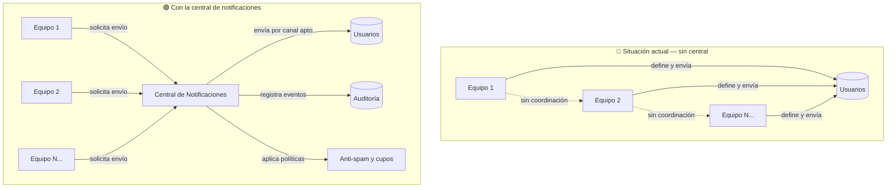
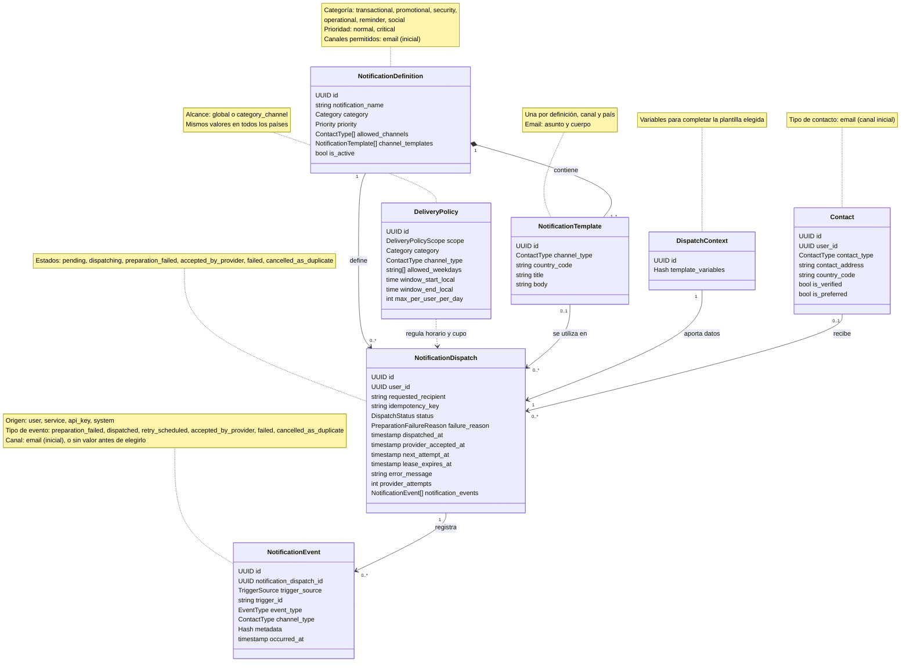
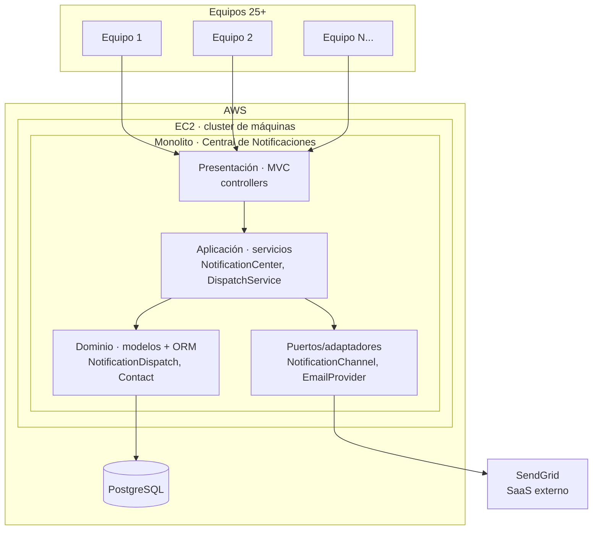
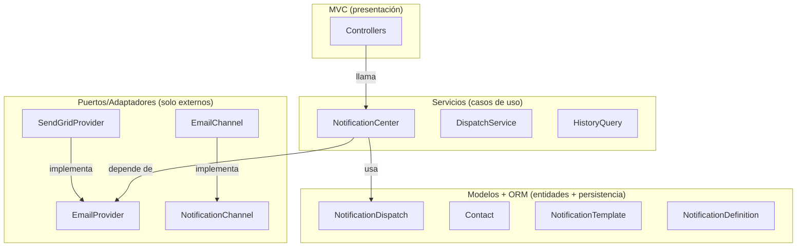
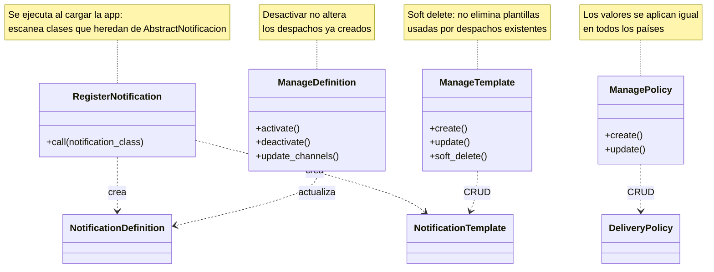
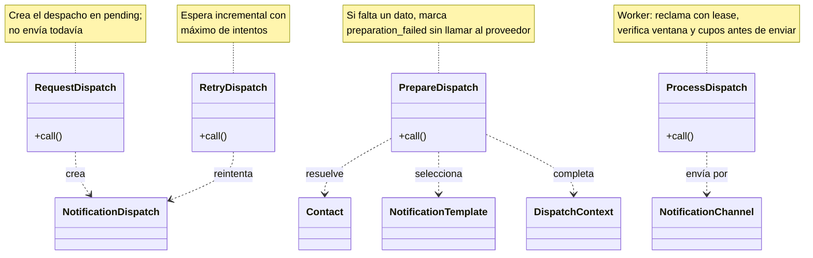
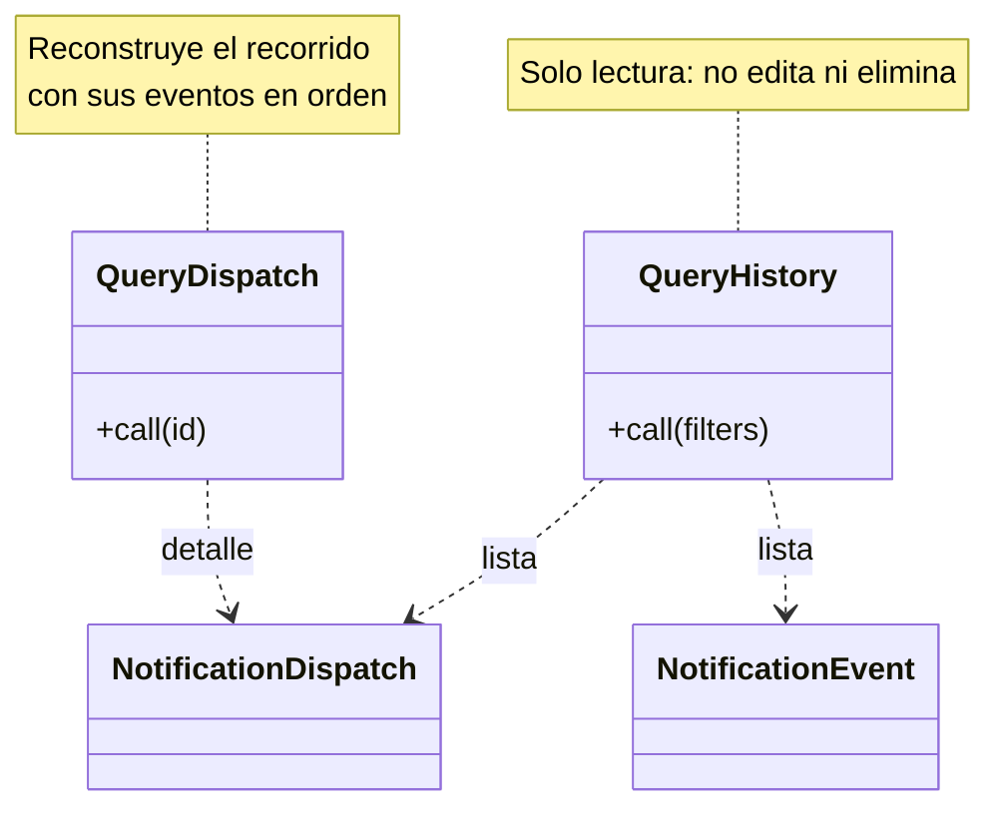
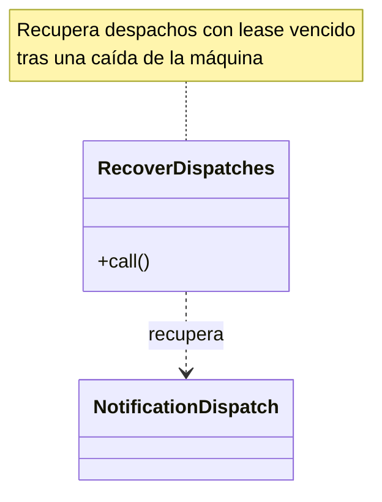
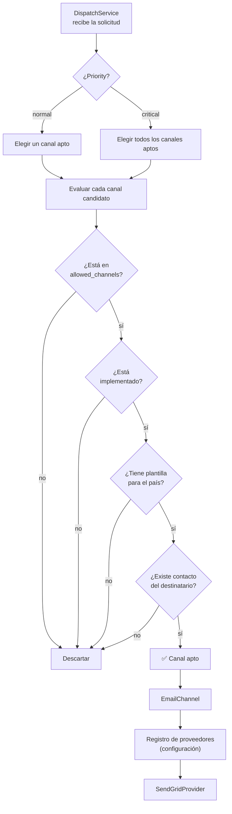
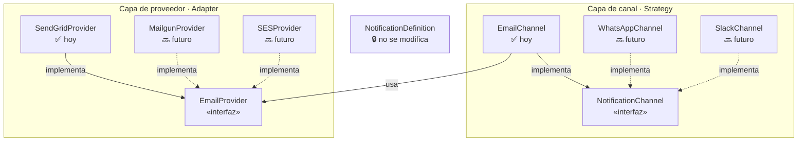

# Central de Notificaciones — Diseño

## 📌 Problema y contexto

> **Fuente:** [PDF 1] — Caso Técnico Buk, "Problema 2.0.pdf"

Hoy, más de 25 equipos crean y envían notificaciones de forma independiente. Esto genera problemas concretos para los usuarios, los clientes y los equipos de desarrollo:

1. **Demasiados mensajes el mismo día.** Cada equipo decide cuándo notificar sin tener en cuenta los mensajes de los demás. Una persona puede recibir correos de cumpleaños, recordatorios y encuestas, además de notificaciones push, en un solo día. **Consecuencia:** recibe comunicaciones en exceso y puede dejar de prestar atención incluso a las importantes.
2. **Envíos duplicados o por canales no previstos.** Si un desarrollador olvida filtrar los canales, una notificación puede salir por todos los disponibles; un error también puede enviar varias veces el mismo correo. **Consecuencia:** el usuario recibe mensajes repetidos o por medios que no correspondían a esa notificación.
3. **Uso inconsistente de los canales.** No hay criterios comunes para elegir el canal ni obligación de implementar cada notificación en todos ellos. Una comunicación simple puede enviarse por SMS y una urgente, solo por email. **Consecuencia:** el comportamiento cambia según el equipo; si se desactiva un canal, algunas notificaciones críticas podrían dejar de llegar.
4. **Crear una notificación requiere coordinar varios archivos.** El nombre debe coincidir en cada uno y una diferencia difícil de detectar puede impedir que funcione. **Consecuencia:** una tarea habitual genera tickets y puede consumir horas de búsqueda de errores.
5. **Las reglas de envío se activan manualmente.** Por ejemplo, crear una entidad desde la web puede disparar una notificación, pero crearla desde la API puede no hacerlo. **Consecuencia:** el mismo hecho de negocio produce resultados distintos según cómo ocurrió, y localizar el fallo lleva tiempo.
6. **No hay un historial central de envíos.** Reconstruir quién recibió una notificación, cuándo y por qué canal es difícil. **Consecuencia:** responder una consulta de un cliente o auditar un envío requiere investigar en varios lugares.

Para abordar estos problemas propongo una **central de notificaciones** que unifique la definición y el envío, y registre lo ocurrido en cada despacho. Las condiciones y los límites de la primera etapa se detallan a continuación.

### 🔍 Mapa del problema actual → solución

Este diagrama muestra cómo se comunican los equipos hoy sin una central, y cómo cambiaría con la solución propuesta. Ayuda a visualizar por qué se necesita un punto único de coordinación.



**Qué cambia:**

| Aspecto | Sin central 🔴 | Con central 🟢 |
| --- | --- | --- |
| **Definición** | Cada equipo crea archivos por su cuenta | Una definición única, reutilizable |
| **Envío** | Directo al canal, sin coordinación | Centralizado con validaciones comunes |
| **Canales** | Inconsistentes, algunos sin implementar | Unificados, extensibles por Strategy |
| **Auditoría** | Dispersa en cada equipo | Historial central de eventos inmutable |
| **Anti-spam** | Inexistente | Ventanas, cupos y deduplicación |

## 🧭 Condiciones iniciales y limitaciones del caso

Esta sección reúne lo que establece el enunciado. Sirve de guía para evaluar las decisiones de diseño del documento, sin confundir las condiciones del caso con la solución propuesta.

### Punto de partida

- **Aplicación:** los equipos trabajan dentro de un monolito y llamarán a las notificaciones directamente desde sus módulos.
- **Entorno:** se puede suponer un clúster simple de AWS EC2, una base de datos PostgreSQL y SendGrid como plataforma para enviar correos.
- **Volumen:** el método de envío podría invocarse hasta **500.000 veces por hora**. El enunciado no especifica cómo se distribuyen esas llamadas dentro de la hora.

### Alcance requerido de la parte 1

- **Definir una notificación:** implementar la API del ejemplo, donde una clase hereda de `AbstractNotificacion` y define `self.title` y `self.body`.
- **Solicitar su envío:** implementar la API que permite llamar, por ejemplo, a `FooNotification.send('juan_perez@gmail.com')` para crear y enviar el correo definido.
- **Canales:** implementar solo **email** ahora. El diseño debe permitir añadir otros canales, como WhatsApp o Slack, sin cambiar la definición de las notificaciones.

### Fuera del alcance requerido en la parte 1

El enunciado presenta el **filtro anti-spam** y una **interfaz simple para consultar el historial** como parte 2 opcional. Tampoco fija la arquitectura interna ni detalla los picos de tráfico o los límites de SendGrid.

## 🏗️ Modelado de la solución

El modelo separa la **definición** de una notificación de cada **envío concreto**. Así, una misma definición puede utilizarse para distintos destinatarios y situaciones sin repetir su contenido. Primero presento las capacidades y reglas de negocio; después explico las entidades y el recorrido de un envío.

### ✅ Capacidades de la central

| Capacidad | Qué debe lograr el sistema |
| --- | --- |
| **Definición de notificaciones** | Permitir definir una notificación una sola vez y reutilizarla en distintos envíos. |
| **Solicitud de envío** | Recibir solicitudes de notificación mediante un endpoint que identifique al usuario destinatario. |
| **Autenticación** | Identificar al consumidor que solicita un envío. |
| **Autorización** | Comprobar que ese consumidor tiene permiso para solicitarlo. |
| **Validación del destinatario** | Comprobar que el contacto tiene una dirección válida para el canal seleccionado. |
| **Validación del canal** | Enviar únicamente por canales permitidos, disponibles y con contenido definido. |
| **Priorización** | Distinguir las comunicaciones críticas y atenderlas antes que las habituales. |
| **Regionalización por país** | Elegir el contenido apropiado para cada país al que se dirige una notificación. |
| **Ventanas de envío** | Programar las notificaciones habituales dentro de los días y horarios permitidos para su categoría y canal. |
| **Control de frecuencia** | Limitar las notificaciones habituales por usuario y día, tanto en total como por categoría y canal. |
| **Administración de plantillas** | Crear, consultar, actualizar y dar de baja plantillas mediante la API; la baja es por *soft delete*. |
| **Validación de contenido** | Evitar el envío de mensajes con plantillas ausentes o variables sin completar. |
| **Preparación y envío** | Preparar el mensaje y entregarlo al proveedor del canal; en esta etapa, enviar correos electrónicos. |
| **Independencia del proveedor** | Permitir cambiar el proveedor de email sin modificar definiciones, plantillas ni estados de las notificaciones. |
| **Rate limit de la API** | Limitar globalmente las solicitudes al endpoint para contener abusos de la API. |
| **Idempotencia** | Evitar que solicitudes del mismo hecho de negocio creen despachos repetidos. |
| **Deduplicación de notificaciones** | Detectar mensajes idénticos que la idempotencia no haya reconocido y registrar su cancelación sin enviarlos. |
| **Recuperación de despachos** | Reanudar envíos inconclusos tras fallos recuperables o caídas de una máquina. |
| **Continuidad ante fallos del proveedor** | Conservar los despachos y retomar su procesamiento después de una interrupción del proveedor. |
| **Gestión de errores** | Detectar y manejar fallos de preparación o envío, conservar su motivo en el despacho y sus eventos y permitir consultarlo para tomar acciones posteriores. |
| **Seguimiento y auditoría** | Consultar por API los despachos y sus eventos para conocer a quién se intentó notificar, cuándo, por qué canal y con qué resultado, sin editarlos ni eliminarlos. |
| **Observabilidad** | Detectar acumulación de despachos, demoras y fallos mediante métricas y alertas. |

**Diferencia con el enunciado:** elegí un endpoint para centralizar autenticación y rate limit. Esta decisión reemplaza la invocación directa `FooNotification.send(email)` solicitada en la API de envío 1.2; la API de definición mediante clases se mantiene.

### 📋 Reglas de negocio

Estas reglas determinan **cuándo se acepta una solicitud**, **qué mensaje se envía** y **qué resultado puede informarse**. Las entidades guardan la información; el caso de uso aplica las reglas.

#### 🔐 Acceso a la central

- La solicitud debe tener una **API key válida** y el consumidor debe contar con permiso para pedir esa notificación; de lo contrario, no se crea un despacho.
- El rate limit se aplica **globalmente al endpoint**, sin separar cupos por API key. Una solicitud que supera el límite recibe `429` y no crea un despacho.
- Toda solicitud, incluida una notificación `critical`, debe incluir el `user_id` del destinatario. Lo proporciona quien invoca el endpoint; la central no lo deduce de la dirección de email.

#### 📬 Destinatario, canal y contenido

- Cada tipo de notificación tiene un nombre único. Una definición inactiva no permite crear despachos nuevos, pero no altera los existentes.
- El contacto debe tener un valor válido para su canal; inicialmente, una dirección de email. Un usuario puede tener varios contactos, pero solo uno preferido.
- Una notificación puede dirigirse a **uno o más países** mediante una plantilla por definición, canal y país.
- El país indicado en la solicitud determina qué plantilla usar. Si no viene, se consulta el país asociado al perfil o contacto; **no se infiere del email**.
- Para cada despacho, el canal debe estar en `allowed_channels`, estar implementado y tener una plantilla para el país seleccionado. En esta etapa el único canal disponible es email, con asunto (`title`) y cuerpo (`body`).
- Antes de enviar, el contenido debe contar con todos los valores que requieren sus variables `{{variable}}`. No se envían mensajes con marcadores sin completar; el contexto usado por el despacho no cambia después de crearlo.
- Si no se logra obtener o validar el contacto, país, canal, plantilla o datos necesarios para construir el mensaje, se registra un despacho `preparation_failed` con un `failure_reason`. Esto ocurre **antes de llamar al proveedor** y sin intentos de envío. El destinatario solicitado se conserva aunque no se haya resuelto un `Contact`.

#### 🕒 Ventanas y cupos por destinatario

- `DeliveryPolicy` define para cada combinación de **categoría y canal** los días de la semana, el horario local permitido y el máximo diario por usuario. Además existe un **máximo total diario por usuario** entre categorías y canales; los mismos valores configurados se aplican en todos los países.
- El día y la ventana se calculan usando la **zona horaria configurada para el país** del destinatario. La solicitud y el perfil no aportan una zona horaria que reemplace esa configuración.
- Una notificación `normal` fuera de horario permanece en `pending` hasta la próxima ventana. Si se agotó el cupo total o el de categoría/canal, permanece en `pending` hasta que vuelva a haber cupo. No se descarta ni se agrupa por estas causas.
- Ambos cupos se comprueban para `normal` y se reservan de forma coordinada entre máquinas **justo antes de intentar el envío**. Un despacho pospuesto no ocupa cupo mientras espera.
- Una notificación `critical` **no espera por la ventana ni por los cupos y no los consume**. Mantiene las demás validaciones de destinatario, canal y contenido. El rate limit global del endpoint es un control distinto de estos cupos por usuario.

#### ⚡ Prioridad y prevención de duplicados

- `Category` indica el propósito del mensaje; por sí sola no establece ni la urgencia ni el canal. `Priority` sí afecta al envío: `normal` utiliza un canal apto y `critical` se procesa primero e intenta todos los canales aptos para el destinatario. Cada canal y contacto genera su propio despacho.
- Si una solicitud repite la misma definición, contacto e `idempotency_key`, se reutiliza el despacho existente **sin volver a enviar**. La clave representa el hecho de negocio conocido por quien solicita el envío.
- Aunque las claves de idempotencia difieran, una notificación con la misma definición, destinatario, canal, país, asunto y cuerpo que otra de la **última hora** se considera duplicada. Se registra un despacho en `cancelled_as_duplicate` sin enviarlo; esto no limita la cantidad de notificaciones *distintas* que recibe una persona.

#### 🧾 Resultado e historial

- Un despacho empieza en `pending`. Los errores recuperables del envío permiten nuevos intentos; `preparation_failed`, `accepted_by_provider`, `failed` y `cancelled_as_duplicate` son resultados terminales en esta etapa.
- Los rechazos por API key, falta de permiso o rate limit ocurren **antes** de crear un despacho; no se registran como `preparation_failed`.
- **Aceptado por el proveedor no significa entregado al destinatario**: para email solo se afirma que el proveedor elegido aceptó el mensaje para procesarlo.
- Los eventos del despacho son inmutables y conservan cuándo ocurrió cada hecho, por qué canal —si llegó a determinarse— y quién o qué inició la solicitud.

### Entidades del modelo y su propósito

El enunciado pide dos API: una para **definir** una notificación y otra para **enviarla**. Este diseño mantiene la primera y utiliza un endpoint para la segunda. Propongo siete entidades internas para identificar qué se envía, por qué canal y país, a quién, bajo qué política de horario y cupos, y qué pasó después. Las citas muestran qué pide el caso; debajo de cada una explico qué aporta el modelo y qué queda fuera.

#### `NotificationDefinition` — definir una sola vez

> “Crear una nueva notificación implica crear varios archivos”  
> “A veces uno se equivoca y demora horas encontrar el error.”

**Por qué elegí este modelo:** decidí usar `NotificationDefinition` para identificar cada tipo de mensaje con un nombre único y vincularlo con sus envíos. El equipo define `self.title` y `self.body` una sola vez en una clase que hereda de `AbstractNotificacion`, como pide la API, sin repetir manualmente el nombre en archivos de cada canal. **Cada definición contiene sus plantillas por canal**; inicialmente tiene la de email. La categoría, prioridad y actividad permiten clasificar y controlar las definiciones. `allowed_channels` declara los canales previstos; el caso de uso de envío consulta ese dato y valida el canal elegido. La entidad guarda la información, pero **no ejecuta la validación por sí sola**.

| Campo (tipo) | Finalidad | Valores posibles / ejemplo |
| --- | --- | --- |
| `id` (UUID) | Identificar la definición dentro de la central. | UUID único. |
| `notification_name` (texto) | Distinguir el tipo de notificación y vincularlo con sus envíos. | Nombre único, p. ej., `FooNotification`. |
| `category` (`Category`) | Clasificar el propósito del mensaje. | `transactional`, `promotional`, `security`, `operational`, `reminder`, `social`. |
| `priority` (`Priority`) | Indicar la urgencia, independientemente de la categoría. | `normal`, `critical`. |
| `allowed_channels` (lista de `ContactType`) | Declarar los canales entre los que el caso de uso puede elegir. | En la primera versión, `email` como único canal disponible. |
| `channel_templates` (colección de `NotificationTemplate`) | Reunir las plantillas de la definición por canal y país. | Una o más plantillas de email, cada una asociada a un país. |
| `is_active` (booleano) | Permitir o impedir la creación de nuevos despachos. | `true` (activa), `false` (inactiva). |

#### `DeliveryPolicy` — cuándo enviar y cuánto puede recibir un usuario

> “Más de 25 equipos de una empresa crean y notifican a sus usuarios sin control.”

**Por qué elegí este modelo:** reuní en `DeliveryPolicy` las ventanas de envío y los máximos diarios para que todos los equipos respeten las mismas reglas. Una política **global** fija el máximo total por usuario entre categorías y canales; las políticas por **categoría y canal** fijan los días, el horario local y su máximo específico. Los valores son configurables y se aplican igual en todos los países. La zona horaria no se guarda en cada política: se consulta una configuración global asociada al país del destinatario.

| Campo (tipo) | Finalidad | Valores posibles / ejemplo |
| --- | --- | --- |
| `id` (UUID) | Identificar una política de envío. | UUID único. |
| `scope` (`DeliveryPolicyScope`) | Distinguir el máximo total de las reglas por categoría/canal. | `global`, `category_channel`. |
| `category` (`Category`) | Identificar a qué propósito aplica la política específica. | Un valor de `Category`; sin valor para la política global. |
| `channel_type` (`ContactType`) | Identificar el canal de la política específica. | `email` en esta etapa; sin valor para la política global. |
| `allowed_weekdays` (lista de días) | Indicar los días habilitados por categoría/canal. | P. ej., `monday` a `friday`; sin valor para la política global. |
| `window_start_local` (hora) | Indicar el inicio permitido en la hora local del destinatario. | Hora configurable; sin valor para la política global. |
| `window_end_local` (hora) | Indicar el fin permitido en la hora local del destinatario. | Hora configurable; sin valor para la política global. |
| `max_per_user_per_day` (entero) | Fijar el máximo de notificaciones normales para ese alcance. | Número configurable; total diario en `global`, diario por categoría/canal en `category_channel`. |

#### `NotificationTemplate` — contenido según el canal

> “Para una misma notificación, los equipos pueden usar los canales que deseen.”  
> “como WhatsApp o Slack”

**Por qué elegí este modelo:** separé `title` y `body` de `NotificationDefinition` porque el contenido depende del medio y del país: un email tiene asunto y cuerpo; un SMS puede necesitar solo texto breve. Decidí asociar **una plantilla a cada definición, canal y país** en `NotificationTemplate`. Los métodos `self.title` y `self.body` mantienen el contrato de definición solicitado en el enunciado; las variantes por país se representan con plantillas sin cambiar esa definición. El caso de uso solo envía si el canal está permitido, disponible y tiene una plantilla para el país indicado.

Por ejemplo, una plantilla de email para recordar una cita podría contener:

- **Título:** «Recordatorio de cita para {{name}}».
- **Cuerpo:** «Hola, {{name}}. Tu cita es el {{date}}.»

Para una notificación dirigida a Chile, si el contexto indica `name: Ana` y `date: 12/10`, el asunto resultante sería **«Recordatorio de cita para Ana»** y el cuerpo **«Hola, Ana. Tu cita es el 12/10.»**. Otra plantilla de la misma notificación puede contener un texto distinto para otro país.

| Campo (tipo) | Finalidad | Valores posibles / ejemplo |
| --- | --- | --- |
| `id` (UUID) | Identificar una plantilla concreta. | UUID único. |
| `channel_type` (`ContactType`) | Asociar el contenido con un canal de la definición. | `email` en esta etapa. |
| `country_code` (texto) | Indicar a qué país corresponde el contenido. | Código de país como `CL` o `MX`; puede haber una variante por país y canal. |
| `title` (texto) | Proporcionar el asunto o título si el canal lo utiliza. | Asunto obligatorio para email, p. ej., `Hola, {{name}}`; sin valor para un canal sin asunto. |
| `body` (texto) | Contener el mensaje adaptado al canal. | Texto fijo o plantilla con variables `{{variable}}`. |

#### `DispatchContext` — completar el contenido

> `'Este es el contenido de la notificación'`

**Por qué lo incluí:** el ejemplo del enunciado usa un cuerpo fijo; no pide personalización. Decidí incluir `DispatchContext` para reutilizar una plantilla cuando cambian datos del mensaje: guarda los valores de ese envío sin modificar la plantilla. Por ejemplo, `Hola, {{name}}` con `name: Ana` produce `Hola, Ana`. Con el contenido fijo del ejemplo, el contexto puede estar vacío.

| Campo (tipo) | Finalidad | Valores posibles / ejemplo |
| --- | --- | --- |
| `id` (UUID) | Identificar el conjunto de datos de un despacho. | UUID único. |
| `template_variables` (mapa) | Completar las variables de la plantilla del canal elegido sin cambiarla. | `{name: 'Ana'}`; `{}` si el texto es fijo. |

#### `Contact` — identificar a quién se envía

> “Disponibilizar solo correo electrónico como canal de comunicación.”  
> “Además, una misma notificación puede enviarse a todos los canales disponibles si el desarrollador olvida aplicar un filtro manual en su implementación.”

**Por qué elegí este modelo:** decidí representar el medio concreto al que se dirige el envío mediante `Contact`: en la parte 1, una dirección de email. Guarda tipo, valor y país, cuando se conoce por el perfil/contacto, para registrar a quién se intenta contactar y seleccionar la plantilla apropiada. El endpoint puede indicar el país en la solicitud; si no lo indica, la central consulta el dato asociado al destinatario. Incluí verificación, preferencia y vínculo con un usuario como atributos del modelo: **el email por sí solo no identifica necesariamente a un usuario ni su país**. La validación de canales corresponde al caso de uso, no a esta entidad.

| Campo (tipo) | Finalidad | Valores posibles / ejemplo |
| --- | --- | --- |
| `id` (UUID) | Identificar un contacto concreto. | UUID único. |
| `user_id` (UUID) | Asociar el contacto al usuario destinatario para compartir cupos entre canales. | UUID del usuario que corresponde al `user_id` de la solicitud. |
| `contact_type` (`ContactType`) | Indicar el medio al que corresponde el contacto. | `email` en la primera versión. |
| `contact_address` (texto) | Guardar la dirección a la que se intentará enviar. | Email válido, p. ej., `juan_perez@gmail.com`. |
| `country_code` (texto) | Conservar el país asociado a ese contacto o su perfil. | `CL`, `MX` o sin valor cuando se desconoce. |
| `is_verified` (booleano) | Señalar si se verificó ese medio de contacto. | `true` (verificado), `false` (no verificado). |
| `is_preferred` (booleano) | Señalar el contacto preferido del usuario. | `true` (preferido), `false` (no preferido). |

#### `NotificationDispatch` — seguir un envío concreto

> “También puede pasar que un error de programación haga que se envíe más de un correo idéntico.”  
> “El método podría ser invocado hasta 500.000 veces por hora.”

**Por qué elegí este modelo:** decidí representar cada solicitud concreta con `NotificationDispatch` y relacionar la definición, los datos usados y, cuando se logran resolver, el contacto y la plantilla del país y canal elegidos. Conserva el `user_id` proporcionado en la solicitud, incluso si falta el contacto, para identificar al destinatario y aplicar los cupos. Su estado, motivo de fallo, intentos, fechas y error permiten seguir qué ocurrió sin confundir ese envío con otros. `next_attempt_at` permite posponer una notificación normal por horario o cupo, además de programar reintentos tras fallos recuperables. **Cada despacho permite consultar sus eventos**, en orden cronológico, para ver cómo llegó a su estado actual. Una `idempotency_key` permite reconocer solicitudes del mismo hecho de negocio; si la clave no detecta un mensaje idéntico, el nuevo despacho se cancela como duplicado antes de enviarlo.

| Campo (tipo) | Finalidad | Valores posibles / ejemplo |
| --- | --- | --- |
| `id` (UUID) | Identificar una solicitud de envío concreta. | UUID único. |
| `user_id` (UUID) | Identificar al destinatario y aplicar sus máximos diarios entre contactos y canales. | UUID obligatorio enviado en la solicitud. |
| `requested_recipient` (texto) | Conservar el destinatario indicado en la solicitud aunque no se resuelva un `Contact`. | Dirección o referencia recibida; sin valor si no se proporcionó ninguna. |
| `idempotency_key` (texto) | Reconocer una solicitud repetida para no volver a enviarla. | Clave del hecho de negocio, p. ej., `solicitud-123-confirmacion`. |
| `status` (`DispatchStatus`) | Mostrar en qué etapa se encuentra el envío. | `pending`, `dispatching`, `preparation_failed`, `accepted_by_provider`, `failed`, `cancelled_as_duplicate`. |
| `failure_reason` (`PreparationFailureReason`) | Explicar por qué no pudo construirse el mensaje antes del envío. | Código de error de preparación; sin valor para los demás estados. |
| `dispatched_at` (fecha y hora) | Registrar cuándo comenzó el primer intento; cada nuevo intento también aparece en los eventos. | Marca de tiempo; sin valor antes del primer intento. |
| `provider_accepted_at` (fecha y hora) | Registrar cuándo el proveedor aceptó el mensaje para su procesamiento. | Marca de tiempo; sin valor hasta la aceptación. |
| `next_attempt_at` (fecha y hora) | Indicar cuándo se puede iniciar o reintentar el envío. | Sin valor mientras se prepara; próxima ventana, disponibilidad de cupo o fecha de reintento. |
| `lease_expires_at` (fecha y hora) | Permitir que otra máquina recupere un despacho si la que lo tomó deja de responder. | Vencimiento del reclamo mientras está `dispatching`; sin valor si no está reclamado. |
| `error_message` (texto) | Guardar el último error, recuperable o definitivo, para investigarlo. | Mensaje de error; sin valor si no hubo fallo. |
| `provider_attempts` (entero) | Contar los intentos de envío al proveedor. | `0` si hubo `preparation_failed`; `1`, `2`, etc., al intentar enviar. |
| `notification_events` (colección de `NotificationEvent`) | Consultar el historial de este despacho. | Cero o más eventos, ordenables por `occurred_at`. |

#### `NotificationEvent` — conservar lo ocurrido

> “Responder a un cliente sobre quien, cuando y como ha sido notificado es un problema.”  
> “La necesidad de un historial como log de auditoría es recurrente.”

**Por qué elegí este modelo:** decidí conservar en `NotificationEvent` hechos que no se sobrescriben cuando cambia el estado del despacho: fallo de preparación, cancelación por duplicidad, inicio de cada intento, programación de un reintento, aceptación por el proveedor o fallo definitivo. **Cada evento pertenece a un despacho concreto**, desde el cual se puede consultar. Su fecha responde **cuándo** ocurrió; el canal responde **cómo**, si llegó a determinarse; el contacto o el destinatario solicitado indica **a quién** se intentó notificar, y `trigger_source`/`trigger_id` ayudan a rastrear **quién o qué inició** la solicitud. En caso de error, el despacho conserva `failure_reason` o `error_message` y el evento registra el motivo en sus metadatos. La aceptación por el proveedor **no demuestra que el destinatario recibió el correo**.

| Campo (tipo) | Finalidad | Valores posibles / ejemplo |
| --- | --- | --- |
| `id` (UUID) | Identificar un hecho registrado. | UUID único. |
| `notification_dispatch_id` (UUID) | Vincular el evento con el despacho al que pertenece. | UUID de un `NotificationDispatch`. |
| `trigger_source` (`TriggerSource`) | Indicar quién o qué inició la solicitud. | `user`, `service`, `api_key`, `system`. |
| `trigger_id` (texto) | Identificar el origen concreto cuando corresponda. | Identificador del usuario, servicio o clave; depende del origen. |
| `event_type` (`EventType`) | Indicar qué pasó en este momento del envío. | `preparation_failed`, `dispatched`, `retry_scheduled`, `accepted_by_provider`, `failed`, `cancelled_as_duplicate`. |
| `channel_type` (`ContactType`) | Registrar el canal utilizado si se llegó a determinar. | `email` en la primera versión; sin valor si el fallo ocurrió antes de elegirlo. |
| `metadata` (mapa) | Conservar datos adicionales útiles para explicar el hecho. | `{failure_reason: 'contact_missing'}` o `{error_message: 'provider timeout'}` en eventos de error; `{}` si no hay datos adicionales. |
| `occurred_at` (fecha y hora) | Registrar cuándo ocurrió el hecho. | Marca de tiempo del evento. |

**Responsabilidad del caso de uso:** las entidades contienen definiciones, políticas y estados, pero es el caso de uso quien aplica ventanas, cupos, deduplicación y validación de canales. La central tampoco activa por sí sola notificaciones cuando ocurre un hecho de negocio: cada equipo debe solicitar el envío.

El diagrama muestra cómo se relacionan estas piezas. Las notas indican los valores posibles de cada tipo; en esta primera versión, el único canal disponible es `email`.



#### Tipos y valores en el flujo de notificación

Estos campos tienen valores definidos. Aquí explico para qué sirve cada valor y cómo participa en el flujo. **Las entidades guardan esos datos; los casos de uso deciden qué hacer con ellos.** Los nombres se mantienen en inglés para coincidir con los campos del modelo.

##### 📬 Canal de comunicación · `ContactType`

Indica el medio asociado a un `Contact`. También aparece en `allowed_channels`, en la plantilla del canal y en los eventos. El caso de uso compara estos datos para elegir el contenido y el proveedor adecuados.

| Valor | Finalidad | Efecto en el envío |
| --- | --- | --- |
| `email` | Identificar una dirección de correo electrónico. | Selecciona el contacto y la plantilla de email; el proveedor configurado procesa el mensaje. Es el único canal implementado en esta etapa. |

##### 🏷️ Propósito de la notificación · `Category`

Clasifica **para qué se comunica** una definición. También permite seleccionar la política de horario y cupo por categoría/canal; **no cambia por sí sola la urgencia ni el canal**.

| Valor | Finalidad | Efecto en el envío |
| --- | --- | --- |
| `transactional` | Identificar comunicaciones sobre una operación realizada. | Distingue, por ejemplo, una confirmación de solicitud para su seguimiento. |
| `promotional` | Identificar ofertas o campañas. | Permite reconocer estos envíos en el historial; la categoría no los bloquea. |
| `security` | Identificar avisos de seguridad. | Los distingue para auditoría; su urgencia depende de `Priority`, no de la categoría. |
| `operational` | Identificar avisos sobre el funcionamiento del servicio. | Permite consultar por separado, por ejemplo, los avisos de mantenimiento. |
| `reminder` | Identificar recordatorios de acciones o fechas. | Permite distinguirlos al consultar los envíos. |
| `social` | Identificar interacciones entre usuarios. | Distingue, por ejemplo, una invitación de otros tipos de mensaje. |

##### 🕒 Alcance de la política · `DeliveryPolicyScope`

Permite usar el mismo modelo para el máximo total diario y para las reglas específicas por categoría y canal. Los cupos cuentan únicamente las notificaciones `normal` de un mismo `user_id` durante su día local.

| Valor | Finalidad | Efecto en el envío |
| --- | --- | --- |
| `global` | Fijar el máximo total diario por usuario entre todas las categorías y canales. | Una notificación normal espera si ya se agotó el cupo total. |
| `category_channel` | Fijar la ventana y el máximo diario para una categoría y un canal. | Una notificación normal espera fuera de los días u horarios permitidos o si se agotó ese cupo. |

##### ⚡ Urgencia · `Priority`

Expresa **cuánta atención requiere** la notificación. Es independiente de `Category`: dos notificaciones de seguridad, por ejemplo, pueden tener distinta urgencia. Esta prioridad sí orienta al caso de uso sobre **cuándo y por cuántos canales intentar el envío**.

| Valor | Finalidad | Efecto en el envío |
| --- | --- | --- |
| `normal` | Comunicar asuntos habituales. | Usa un canal apto; espera por la ventana o por cualquiera de los dos cupos si corresponde. |
| `critical` | Comunicar asuntos que requieren atención urgente. | Se prioriza y se intenta por **todos los canales aptos** sin esperar por ventana ni cupos y sin consumirlos. |

Un canal es **apto** si está en `allowed_channels`, está implementado, tiene una plantilla y existe un contacto del destinatario para ese canal. Un envío crítico se representa con **un `NotificationDispatch` por canal y contacto aptos**; cada despacho tiene su propio estado y sus eventos. En la parte 1 solo email está implementado. Esta regla no permite enviar por canales no previstos ni garantiza entrega inmediata.

##### 🔄 Estado del envío · `DispatchStatus`

Describe **en qué punto está un `NotificationDispatch` ahora mismo**. Permite al caso de uso saber si debe iniciar el envío, si sigue en curso o si ya terminó. El diagrama de la siguiente sección muestra las transiciones permitidas.

| Valor | Finalidad | Efecto en el flujo |
| --- | --- | --- |
| `pending` | Señalar que el despacho está en preparación o espera horario, cupo, primer intento o reintento. | Tras prepararse, solo puede reclamarse cuando llega `next_attempt_at` y las reglas permiten enviarlo. |
| `dispatching` | Señalar que el envío está en curso. | Se espera la respuesta del proveedor o el resultado de los intentos. |
| `preparation_failed` | Indicar que faltaron datos o recursos para construir el mensaje. | Cierra el despacho antes de cualquier intento; `failure_reason` identifica la causa. |
| `accepted_by_provider` | Indicar que el proveedor aceptó el mensaje para procesarlo. | Cierra con éxito el despacho en esta etapa; **no confirma que el destinatario lo recibió**. |
| `failed` | Indicar un error definitivo del envío o intentos agotados. | Cierra el despacho tras intentar enviarlo; se distingue de `preparation_failed`. |
| `cancelled_as_duplicate` | Indicar que el mensaje coincide con otro ya registrado. | Cierra el despacho sin llamar al proveedor; no es un fallo de entrega. |

##### 🧭 Origen del envío · `TriggerSource`

Se registra en `NotificationEvent` para identificar **quién o qué inició** la solicitud. `trigger_id` identifica el origen concreto cuando corresponde. Este campo aporta trazabilidad, pero no activa automáticamente notificaciones ni cambia la selección de canal.

| Valor | Finalidad | Efecto en el flujo |
| --- | --- | --- |
| `user` | Identificar una acción iniciada por una persona usuaria. | Ayuda a rastrear quién inició la solicitud. |
| `service` | Identificar una solicitud originada por un servicio. | Permite ubicar el componente que solicitó el envío. |
| `api_key` | Identificar una solicitud mediante una clave de API. | Permite rastrear la credencial utilizada para invocar el endpoint. |
| `system` | Identificar una acción automática del sistema. | Permite distinguir envíos automáticos de solicitudes iniciadas por otros orígenes. |

##### 🧾 Hecho registrado · `EventType`

Indica **qué ocurrió** en un momento del envío. A diferencia de `DispatchStatus`, que muestra el estado actual, los eventos permanecen para reconstruir el recorrido y responder consultas de auditoría.

| Valor | Finalidad | Efecto en el historial |
| --- | --- | --- |
| `preparation_failed` | Registrar que no se pudo construir la notificación. | Conserva el momento y motivo del fallo sin afirmar que se intentó enviar. |
| `dispatched` | Registrar que comenzó el envío por el canal. | Permite saber cuándo empezó el envío de ese despacho. |
| `retry_scheduled` | Registrar que un fallo recuperable o un reclamo vencido exige otro intento. | Conserva cuándo y por qué se programó el siguiente intento, sin marcar el despacho como fallido definitivamente. |
| `accepted_by_provider` | Registrar que el proveedor aceptó el mensaje para procesarlo. | Permite verificar la aceptación por el proveedor sin afirmar entrega al destinatario. |
| `failed` | Registrar un fallo definitivo. | Conserva el momento y el contexto del error aunque el estado del despacho se consulte más tarde. |
| `cancelled_as_duplicate` | Registrar que se detectó contenido duplicado antes del envío. | Permite explicar por qué no se llamó al proveedor para ese despacho. |

### 🚨 Posibles errores del dominio

Los valores de `PreparationFailureReason` describen por qué una solicitud **no pudo preparar el mensaje**. Se guardan en `failure_reason` de un despacho `preparation_failed` y pueden acompañar el evento del mismo nombre. En todos estos casos `provider_attempts` es `0`: no se llamó al proveedor.

| `failure_reason` | Qué ocurrió |
| --- | --- |
| `contact_missing` | No se encontró un medio de contacto para el destinatario solicitado. |
| `contact_invalid` | El dato de contacto existe, pero no es válido para su canal. |
| `country_missing` | No se obtuvo el país ni de la solicitud ni del perfil/contacto. |
| `template_missing` | No hay una plantilla para la definición, el canal y el país seleccionados. |
| `template_variables_missing` | Faltan valores para completar una o más variables del título o cuerpo. |
| `channel_unavailable` | El canal no está permitido para esa definición o no está implementado. |

Un despacho `failed` representa un fallo **al intentar enviar**, no al preparar el mensaje. `cancelled_as_duplicate` representa una cancelación, no un error. Los rechazos por autenticación, autorización o rate limit ocurren antes de crear despachos y no utilizan estos motivos.

## 🏛️ Arquitectura de software e infraestructura

La central vive dentro del monolito y se organiza en capas. Los equipos invocan la librería; la solicitud baja por las capas hasta llegar a los proveedores externos. El diagrama une la vista de software (capas) con la de infraestructura (dónde corre cada pieza).



| Elemento | Dónde corre |
| --- | --- |
| Monolito (4 capas) | AWS EC2 (cluster) |
| PostgreSQL | AWS (base de datos) |
| SendGrid | SaaS externo, fuera de AWS |
| Equipos | Invocan desde sus módulos |

**Cómo se lee:** los equipos invocan la central desde sus módulos. El monolito corre en un cluster EC2 y contiene las cuatro capas: la solicitud entra por los controllers (presentación), delega en los servicios (aplicación), que persisten en los modelos (dominio, vía ORM hacia PostgreSQL) y envían por los puertos (canales/proveedores hacia SendGrid). PostgreSQL queda dentro de AWS; SendGrid es un SaaS externo.

## 📦 Diseño de la librería

La librería es el **núcleo del sistema de notificaciones**: un componente interno del monolito que los equipos invocan directamente y que concentra toda la lógica de envío. Sigue una arquitectura MVC **agnóstica del framework**: **modelos de dominio + ORM** para las entidades, **servicios** para los casos de uso, y **puertos/adaptadores** solo para las dependencias externas (SendGrid y canales).

### 🎯 Rol de la librería

| Responsabilidad | Qué hace |
| --- | --- |
| **Definir** | Registrar notificaciones a partir de clases que heredan de `AbstractNotificacion`. |
| **Enviar** | Recibir solicitudes de envío, validarlas y encolar el despacho. |
| **Administrar** | Crear, consultar y dar de baja plantillas y políticas. |
| **Auditar** | Registrar y consultar el historial de despachos y eventos. |

### 🧱 Separación de capas

El monolito asume arquitectura MVC. La librería se integra respetando esa arquitectura, sin depender de un framework concreto:

| Capa | Implementación | ¿Abstraer? |
| --- | --- | --- |
| **Entidades + persistencia** | Modelos de dominio persistidos por un ORM (en Rails, `ActiveRecord`) | No, el ORM ya lo hace |
| **Casos de uso** | Servicios (`NotificationCenter`, `DispatchService`) | No, son clases simples |
| **Proveedores externos** | Puertos + adaptadores (`EmailProvider`, `NotificationChannel`) | **Sí**, es la única frontera que vale la pena |

**Regla de dependencia:** los servicios usan los modelos y dependen de los puertos; los adaptadores implementan los puertos. Los modelos no conocen a los servicios ni a los proveedores.



### ⚙️ Servicios (casos de uso)

La API pública de la librería es un **servicio** que los equipos invocan. Internamente orquesta los modelos y los puertos. Los casos de uso cubren todas las capacidades de la central, agrupados por responsabilidad.

```
# API pública — los equipos llaman a esto
NotificationCenter.send(
  notification_name,
  user_id,
  recipient,
  idempotency_key,
  country_code = nil
)
```

**Por qué servicios:** los controllers quedan finos (solo traducen la petición) y la lógica de negocio vive en clases simples, testeables sin HTTP ni base de datos.

#### 📝 Definición y administración

| Use case | Qué hace |
| --- | --- |
| `RegisterNotification` | Registra una definición desde la clase (`title`/`body` → `NotificationDefinition` + `NotificationTemplate`). |
| `ManageTemplate` | CRUD de plantillas (crear, consultar, actualizar, soft delete). |
| `ManagePolicy` | CRUD de `DeliveryPolicy` (ventanas, cupos). |
| `ManageDefinition` | Activar/desactivar definiciones, actualizar `allowed_channels`. |



#### 📤 Envío (runtime)

| Use case | Qué hace |
| --- | --- |
| `RequestDispatch` | Recibe la solicitud y crea el despacho en `pending`. |
| `PrepareDispatch` | Resuelve contacto, país, plantilla y contexto; valida contenido. |
| `ProcessDispatch` | Worker: reclama, verifica ventana/cupos, envía por el canal. |
| `RetryDispatch` | Programa y ejecuta reintentos tras fallos recuperables. |



#### 🔍 Consulta y auditoría

| Use case | Qué hace |
| --- | --- |
| `QueryHistory` | Lista despachos y eventos con filtros. |
| `QueryDispatch` | Detalle de un despacho y su recorrido. |



#### ⚙️ Sistema

| Use case | Qué hace |
| --- | --- |
| `RecoverDispatches` | Recupera despachos huérfanos (lease vencido, máquina caída). |



**Preocupaciones transversales:** `Autenticación`, `Autorización` y `Rate limit` **no son responsabilidad de los casos de uso**. Se resuelven en la capa de presentación (controllers o middleware) **antes** de invocar el servicio. El caso de uso asume que quien lo llama ya fue autenticado, autorizado y no superó el límite.

### 🧩 Puerto del canal · Strategy

> “Disponibilizar solo correo electrónico como canal de comunicación.”  
> “Debe estar diseñada para poder implementar nuevos canales de comunicación (como WhatsApp o Slack) de manera que no requiera cambios en la definición de la notificación.”

Hoy el único canal es **email**, pero el diseño debe permitir añadir **WhatsApp, Slack u otros** sin tocar la definición de la notificación. Para lograrlo, cada canal implementa una **interfaz común**: el servicio no conoce los detalles de cada canal, solo llama a los métodos del contrato. Los parámetros son las **entidades del modelo**.

```
# Contrato del canal — todos los canales lo implementan
interface NotificationChannel
  send(dispatch, contact, template, context)   # envía el mensaje preparado
  validate(contact)                            # valida el formato del contacto para este canal
  status(provider_message_id)                  # consulta el estado en el proveedor
```

| Método | Qué hace | Parámetros (entidades) |
| --- | --- | --- |
| `send` | Entrega el mensaje al proveedor del canal. | `NotificationDispatch`, `Contact`, `NotificationTemplate`, `DispatchContext` |
| `validate` | Valida el **formato** del contacto para este canal (p. ej., email bien formado). | `Contact` |
| `status` | Consulta el resultado en el proveedor. | `provider_message_id` |

**Dos validaciones de contacto, dos responsables:** la **resolución** (¿existe un `Contact` para el destinatario?) la hace el servicio consultando el modelo `Contact`; el **formato** (¿la dirección es válida para el canal?) lo hace el canal con `validate(contact)`. La primera produce `contact_missing`; la segunda, `contact_invalid`.

**Por qué Strategy:** añadir un canal nuevo es implementar este contrato y registrarlo. No se modifica `NotificationDefinition` ni el servicio. El servicio solo comprueba que el canal esté en `allowed_channels`, esté implementado y tenga plantilla para el país. El contrato es independiente del lenguaje: en Ruby se expresa como un módulo, en otros lenguajes como una interfaz o clase abstracta.

#### Selección del canal y del proveedor

El servicio elige el **canal** en tiempo de ejecución según las reglas de negocio; el **proveedor** se resuelve por configuración, no por lógica de envío.



**Cómo se lee:** el servicio decide cuántos canales intentar según `Priority` (uno para `normal`, todos para `critical`). Para cada candidato, comprueba las cuatro condiciones de "apto": en `allowed_channels`, implementado, con plantilla para el país y con contacto del destinatario. La condición "¿Existe contacto?" es la **resolución** (el servicio consulta el modelo `Contact`); el **formato** lo valida después el canal con `validate(contact)`. El canal elegido resuelve su proveedor desde un **registro de configuración** (no por lógica de envío): hoy `EmailChannel` apunta a `SendGridProvider`; mañana puede apuntar a otro sin tocar el servicio.

### 🔌 Puerto del proveedor · Adapter

Dentro del canal email, el proveedor (SendGrid) queda **detrás de una interfaz propia**. Así, cambiar SendGrid por otro proveedor (Mailgun, SES, etc.) no toca el canal ni el dominio. Lo mismo aplica a futuro: cada canal puede tener varios proveedores intercambiables.

```
# Contrato del proveedor de email — detrás del canal email
interface EmailProvider
  deliver(message)               # entrega el mensaje y devuelve su identificador
  status(provider_message_id)    # consulta el estado de un mensaje entregado
```

| Método | Qué hace |
| --- | --- |
| `deliver` | Envía el mensaje y devuelve el `provider_message_id`. |
| `status` | Consulta el estado de un mensaje en el proveedor. |

**Por qué Adapter:** el dominio habla en términos de "despacho aceptado", no de "SendGrid respondió 202". El adapter traduce la respuesta del proveedor a los estados del dominio (`accepted_by_provider`, `failed`). Cambiar de proveedor no altera definiciones, plantillas, estados ni motivos de error.

### 🔮 Extensibilidad: canales y proveedores

El diseño cumple el requisito del enunciado: hoy solo **email**, mañana otros **canales** y otros **proveedores**, sin cambiar la definición de la notificación. El diagrama muestra lo que existe hoy (✅) y lo que se puede añadir después (🔜) implementando el mismo contrato.



**Cómo se lee:** añadir un canal (WhatsApp, Slack) es implementar `NotificationChannel`; añadir un proveedor (Mailgun, SES) es implementar `EmailProvider`. En ningún caso se toca `NotificationDefinition` ni el servicio. Las flechas sólidas marcan lo implementado hoy; las punteadas, lo que se puede añadir después.
