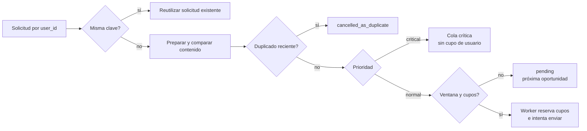
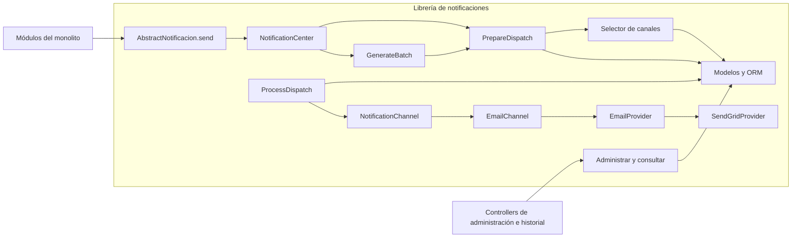
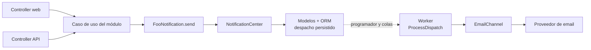
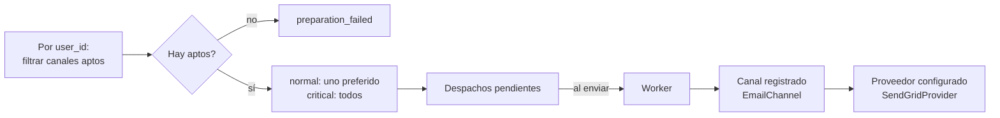
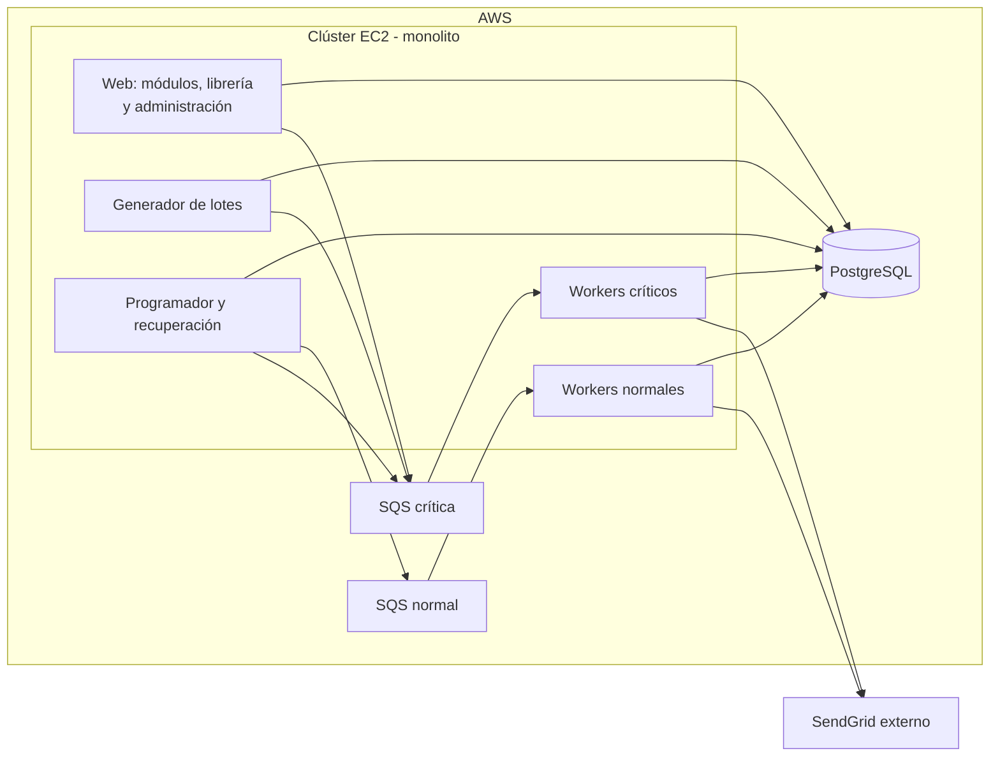
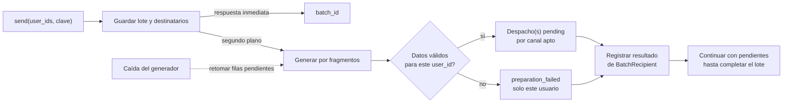
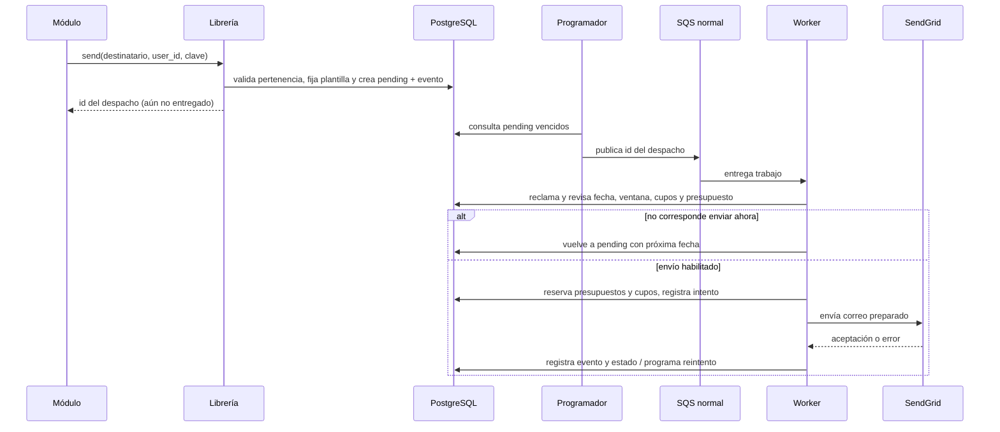
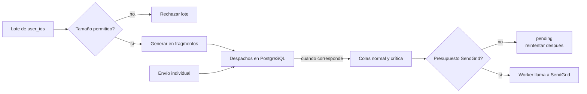

# 📬 Central de notificaciones — propuesta de diseño

> **Estado:** borrador para revisión técnica. Este documento describe una solución propuesta; no afirma que ya esté implementada. Parte del [caso técnico](../Problema%202.0.pdf) y conserva el detalle del [diseño original](DESIGN.md).

## 1. 🧭 La propuesta en breve

Más de 25 equipos envían notificaciones desde un monolito sin reglas compartidas. Esto produce mensajes duplicados, uso irregular de canales y poca trazabilidad. Propongo una librería interna que reciba solicitudes para una persona o un conjunto de `user_id`, genere un despacho independiente por destinatario y canal apto, aplique reglas comunes y registre el resultado de cada intento.

El primer canal es **email**, mediante SendGrid. Una interfaz de canal permite incorporar otros medios sin reescribir las clases que definen las notificaciones. Los envíos se procesan en segundo plano: la llamada de la librería confirma que se aceptó una solicitud, **no** que el destinatario recibió el correo. En un lote, la generación de los despachos también ocurre en segundo plano.

El enunciado pide definir y enviar notificaciones con una API de clases; presenta el control de spam y una interfaz de historial como parte opcional. Aquí se diseñan además políticas de envío, auditoría y recuperación, porque afectan a las decisiones de persistencia y concurrencia. Su incorporación al diseño no implica que todas esas funciones deban entregarse a la vez.

**Límite importante:** la central unifica *cómo* se solicita y procesa una notificación; no detecta por sí sola que ocurrió un hecho de negocio. Los módulos todavía deben llamar a la librería. Por tanto, no elimina automáticamente las diferencias entre disparadores web y API.

## 2. 🎯 Qué debe resolver

| Resultado observable | Decisión que lo permite | Dónde se explica |
| --- | --- | --- |
| Una clase define una notificación sin crear un archivo por canal. | Registro de la definición y plantillas asociadas a ella. | [Contrato de la librería](#contrato-de-la-librería-una-persona-o-un-lote) |
| Un módulo solicita el envío de un correo desde el monolito. | API de la librería; preparación síncrona y envío asíncrono. | [Contrato](#contrato-de-la-librería-una-persona-o-un-lote) y [recorrido](#de-un-despacho-al-proveedor) |
| Un módulo solicita notificaciones para varios `user_id` a la vez. | Lote persistido, generación por destinatario en segundo plano y seguimiento individual. | [Generación del lote](#de-una-lista-de-usuarios-a-despachos-independientes) |
| Un canal no autorizado o sin contenido no produce un envío accidental. | Selección central de canales aptos antes de encolar. | [Selección de canal](#selección-de-canal-y-proveedor) |
| Se pueden añadir canales sin cambiar las clases existentes. | Contrato `NotificationChannel` y plantilla por definición, canal y país. | [Puertos y adaptadores](#selección-de-canal-y-proveedor) |
| Se pueden investigar solicitudes, intentos y resultados. | Un despacho con estado actual y eventos de solo adición. | [Estados y garantía](#estados-y-garantía-de-entrega) |
| Las comunicaciones normales respetan ventanas y cupos; las críticas se adelantan. | Política por categoría/canal, máximo total por usuario y dos colas. | [Control de saturación](#control-de-saturación-y-prevención-de-spam) y [reserva](#reserva-de-cupos-y-recuperación) |
| Una solicitud grande o muchos workers no saturan SendGrid sin control. | Tamaño máximo de lote y presupuesto global de intentos hacia el proveedor. | [Capacidad del proveedor](#capacidad-del-proveedor-y-lotes) |
| Una caída recuperable no hace perder una solicitud aceptada. | PostgreSQL como fuente de verdad, reintentos y recuperación de reclamos vencidos. | [Infraestructura](#infraestructura) y [garantía](#estados-y-garantía-de-entrega) |

**Supuestos:** el monolito corre en varias máquinas EC2, usa PostgreSQL y envía email mediante SendGrid. Hasta 500.000 llamadas por hora equivalen a unas **139 por segundo de promedio**, pero una llamada puede generar varios despachos. El caso no especifica picos, tamaño de los lotes ni límites de SendGrid. La capacidad final dependerá de esas mediciones y del número de destinatarios por llamada.

## 3. 📨 Comportamiento esperado

Esta sección fija lo que observará un módulo al solicitar una notificación y las reglas que la central aplicará, antes de describir su implementación.

### Contrato de la librería: una persona o un lote

La definición conserva la forma del enunciado:

```ruby
class FooNotification < AbstractNotificacion
  def self.title = 'Título de la notificación'
  def self.body = 'Contenido de la notificación'
end
```

La solicitud propuesta añade los datos que requieren las políticas y la trazabilidad:

```ruby
FooNotification.send(
  'juan_perez@gmail.com',
  user_id: juan.id,
  idempotency_key: 'solicitud-123-confirmacion',
  country_code: 'CL',
  variables: {}
)
```

`user_id` e `idempotency_key` son obligatorios en esta interfaz. El primero permite aplicar cupos al destinatario correcto; la segunda identifica el hecho de negocio para que una repetición de la llamada no genere otro envío. La invocación literal `FooNotification.send('correo')` del enunciado **no aporta esos datos y no funciona sin adaptación**. Esta diferencia es una decisión consciente: adoptar el diseño requiere que los módulos proporcionen ambos valores o que exista un adaptador con una fuente confiable para obtenerlos; nunca se deduce `user_id` del texto del email.

`send` devuelve el identificador del despacho o los despachos creados (uno por canal y contacto aptos), o los existentes si reconoce la misma clave. Si faltan datos para preparar el mensaje, devuelve un resultado de preparación fallida con su identificador; la consulta del historial permite conocer lo sucedido después. Un rechazo de los endpoints administrativos ocurre antes de crear despachos.

Para notificar a varias personas, el módulo pasa sus identificadores; la central resuelve el contacto de cada una. No se comparte la dirección de email del ejemplo anterior:

```ruby
FooNotification.send(
  user_ids: [juan.id, ana.id],
  idempotency_key: 'encuesta-2026-10',
  variables: {}
)
```

Esta variante devuelve un `batch_id` cuando el lote y sus destinatarios quedan guardados; **todavía no confirma que todos los despachos estén preparados**. Cada destinatario se prepara por separado: si falta un contacto o una variable, ese usuario obtiene un `preparation_failed` y el resto continúa. `variables` contiene datos comunes; si el contenido necesita valores particulares por usuario, se añade `variables_by_user_id: { juan.id => { name: 'Juan' } }`. Estos valores se guardan con cada destinatario del lote; no se reutiliza el contexto de otra persona.

La consulta del lote informa cuántos destinatarios siguen pendientes de preparación, cuántos tienen despachos creados y cuántos fallaron; el resultado de envío se consulta en cada despacho. Un lote completamente generado **no significa** que sus correos ya hayan sido aceptados por SendGrid.

### Plantillas y contexto

**Contenido inicial y ediciones:** al registrar por primera vez una clase, `title` y `body` crean la plantilla inicial de email. Desde entonces, la base de datos es la fuente de verdad: volver a cargar la clase no sobrescribe ediciones administrativas. Actualizar una plantilla crea una versión nueva; los despachos preparados conservan la versión y el contexto inmutable que utilizarán. Darla de baja impide nuevas preparaciones, pero no invalida las ya realizadas.

Por ejemplo, una plantilla de email para Chile puede tener el asunto `Recordatorio para {{name}}` y el cuerpo `Hola, {{name}}. Tu cita es el {{date}}.`. Con `variables: { name: 'Ana', date: '12/10' }`, se prepara el asunto **«Recordatorio para Ana»** y el cuerpo **«Hola, Ana. Tu cita es el 12/10.»**. En un lote, `date` puede ser común y `name` llegar en `variables_by_user_id` para cada persona. Si falta una variable requerida, solo el despacho de esa persona termina en `preparation_failed`, antes de llamar al proveedor. En los despachos preparados, el contexto queda fijo aunque luego se actualice la plantilla.

### Destinatario, canal y país

La librería comprueba que el contacto pertenece a `user_id`, tiene una dirección válida y que el canal está permitido, implementado y tiene plantilla para el país seleccionado. El país viene de la solicitud o, si falta, del perfil/contacto; no se infiere del dominio del email. El contenido no se envía si faltan variables de la plantilla.

Por cada usuario del lote se aplican las mismas reglas que al envío individual. Una notificación `normal` usa **un** canal apto, elegido con un orden de preferencia configurado y estable. Una `critical` crea un despacho por **cada contacto y canal aptos** para cada usuario. En ambos casos el canal disponible al inicio es solo email. Si no hay ningún canal apto, se conserva un despacho `preparation_failed` para ese usuario con un motivo como `contact_missing`, `template_missing` o `channel_unavailable`; no se simula un intento de envío.

### Control de saturación y prevención de spam

La central controla dos formas de saturación: **cuántos mensajes intenta recibir una persona** y **a qué ritmo se llama a SendGrid**. Son límites distintos. También evita solicitudes repetidas y mensajes idénticos; un lote no salta ninguna regla por agrupar usuarios.

#### Ventanas y cupos por destinatario

`DeliveryPolicy` reúne reglas que deben compartir todos los equipos. Una política global fija el máximo diario de notificaciones `normal` por `user_id` entre categorías y canales. Las políticas por categoría/canal fijan sus días, horario local y máximo diario específico. Ambos cupos se aplican a cada despacho, incluso si proviene de un lote, y sus valores son configurables sin modificar las definiciones de notificación.

Los valores son comunes a todos los países. Para calcular el día y la ventana se usa la zona horaria configurada para el país del destinatario: esto simplifica el modelo, pero puede ser impreciso en países con varias zonas horarias. Si un envío `normal` cae fuera de ventana o agota cualquiera de los dos cupos, sigue en `pending` hasta la próxima ventana o día con cupo; no ocupa cupo mientras espera. Un envío `critical` no espera por estas reglas ni consume cupo por usuario, aunque sí respeta la capacidad del proveedor.

#### Mensajes repetidos

La clave de idempotencia representa un hecho de negocio. Para una misma definición, usuario, contacto y clave, una nueva llamada devuelve el despacho existente; si cambian datos relevantes bajo la misma clave, se rechaza la solicitud para no ocultar una contradicción. En un lote, la misma definición y clave con el mismo conjunto de `user_id` y variables, comunes e individuales, devuelven el `batch_id` existente; cambiar esos datos con la misma clave es un error. El conjunto se compara después de eliminar duplicados y ordenar los identificadores. El resultado de preparación de cada `BatchRecipient` y sus despachos se guardan juntos, con unicidad por destinatario, canal y contacto; volver a procesar esa fila no genera otro despacho, incluido un fallo sin contacto.

Una protección adicional compara definición, destinatario, canal, país, asunto y cuerpo durante la última hora. Si coinciden, crea un despacho `cancelled_as_duplicate` sin enviar. Esta segunda regla puede bloquear comunicaciones legítimas idénticas; sus excepciones deben configurarse por tipo de notificación, especialmente para mensajes críticos. En los lotes las comparaciones son **por usuario**, nunca entre destinatarios distintos.

El diagrama reúne los resultados posibles **para un destinatario**. La clave de idempotencia se comprueba al solicitar el envío; después se prepara el contenido y se detectan duplicados. En la rama `normal`, el worker vuelve a verificar ventana y cupos justo antes del intento, aunque el programador haya adelantado esa revisión. Las excepciones de deduplicación para tipos críticos se aplican antes de decidir si el contenido es duplicado.



#### Capacidad global

Una configuración independiente de `DeliveryPolicy` limita los intentos hacia SendGrid entre todas las máquinas. Si se agota, el despacho espera en `pending` sin consumir cupo del usuario; esto también aplica a `critical`. Los lotes tienen un tamaño máximo y se generan por partes. Solo responsables autorizados pueden cambiar una definición a `critical`, para que la excepción a los cupos por usuario no se use como atajo. El mecanismo y los casos de carga se muestran en [Capacidad del proveedor y lotes](#capacidad-del-proveedor-y-lotes).

## 4. ⚖️ Decisiones técnicas

Con el comportamiento definido, esta tabla resume las elecciones de implementación, sus ventajas y sus costos. Las secciones siguientes muestran cómo se conectan.

| Decisión | Ventaja | Costo o limitación |
| --- | --- | --- |
| **Librería dentro del monolito**, invocada por sus módulos. | Evita una llamada HTTP adicional entre componentes de la misma aplicación. | El origen de la solicitud debe ser confiable; los controles HTTP de administración no protegen esta invocación interna. |
| **PostgreSQL conserva el despacho; SQS transporta trabajos.** | La solicitud persiste antes del intento de envío y puede recuperarse aunque falle la cola o un worker. | La publicación en SQS puede repetirse; reclamar un despacho debe ser atómico e idempotente. |
| **Preparación síncrona para una persona; por lotes en segundo plano.** | Un lote puede contener muchos usuarios; no debe bloquear al módulo mientras se resuelve cada contacto. | La respuesta individual informa aceptación o fallo de preparación; la del lote solo confirma que se guardó la solicitud. Ninguna confirma entrega. |
| **Lotes persistidos y procesados en fragmentos acotados.** | Una caída a mitad de una lista no debe perder ni duplicar destinatarios. | Se añade seguimiento del progreso, un máximo configurable de usuarios por lote y capacidad para reanudar la generación. |
| **Plantillas versionadas en la base de datos.** | Una edición administrativa no cambia el contenido de despachos ya preparados. | Hay que administrar versiones y retener las utilizadas durante el período de auditoría. |
| **Cupo reservado por el worker, al comenzar un intento.** | No se consume cupo mientras el despacho espera en la base de datos o en SQS. | Ventana y cupo se comprueban nuevamente en el worker, aunque el programador ya los haya revisado. |
| **Presupuesto global de SendGrid, separado de `DeliveryPolicy`.** | Contiene el ritmo de salida entre máquinas sin alterar los cupos por destinatario. | Requiere coordinación en PostgreSQL y puede retrasar incluso los envíos críticos. |
| **Identidad del usuario explícita.** | Los cupos se comparten entre sus contactos y canales; un email no identifica siempre a una persona. | La firma ampliada exige `user_id` y verificar que el contacto le pertenece; difiere del ejemplo mínimo del caso. |
| **Canal y proveedor son dos fronteras distintas.** | Añadir Slack es diferente de sustituir SendGrid por otro proveedor de email. | Cada canal necesita un adaptador y pruebas de su contrato. |

**Balance:** el envío asíncrono evita esperar a SendGrid, a cambio de consultar el resultado después; los lotes y las dos colas permiten escalar y priorizar, a cambio de más procesos que operar. La central tampoco resuelve por sí sola los disparadores web/API: cada equipo sigue siendo responsable de invocarla cuando ocurre el hecho de negocio.

## 5. 🧩 Arquitectura y modelo

### Arquitectura de software

Esta vista responde **cómo se organiza la librería**, sin mezclar procesos o servicios de AWS. Los módulos llaman a `AbstractNotificacion.send`; `NotificationCenter` coordina la preparación individual o la generación de lotes. Los casos de uso aplican las reglas con los modelos persistidos por el ORM; `ProcessDispatch` utiliza puertos para llegar a integraciones externas. Los controllers de administración y consulta tienen una entrada separada: no median los envíos solicitados por los módulos.



Las flechas entre puertos e implementaciones muestran la resolución del contrato, no una dependencia del dominio hacia SendGrid. El selector usa el registro de canales; `ProcessDispatch` invoca el canal seleccionado cuando corresponde enviarlo. El ORM persiste definiciones, lotes, despachos y eventos; los servicios no dependen de un proveedor concreto.

### Uso de la librería en MVC y extensiones futuras

En un monolito MVC, los controllers web y API traducen la petición y llaman al mismo caso de uso del módulo de negocio. Tras confirmar el hecho que origina la comunicación, ese módulo invoca la clase de notificación; no necesita enviar un HTTP a otra aplicación ni conocer SendGrid. Por ejemplo, después de crear una solicitud:

```ruby
# En el caso de uso del módulo, compartido por web y API
FooNotification.send(
  solicitud.usuario.email,
  user_id: solicitud.usuario.id,
  idempotency_key: "solicitud-#{solicitud.id}-creada"
)
```

El diagrama muestra **cómo entra una solicitud desde MVC**: web y API comparten el caso de uso, que invoca la librería directamente. Una tarea interna también puede usar ese caso de uso sin pasar por un controller. La flecha punteada resume el procesamiento posterior mediante programador y colas; su detalle está en el [recorrido del envío](#de-un-despacho-al-proveedor).



`AbstractNotificacion.send` delega en `NotificationCenter`: los servicios preparan el despacho con los modelos del ORM y devuelven su identificador; el worker llama después a `ProcessDispatch` para enviar por el canal seleccionado. Los controllers HTTP de administración e historial aplican autenticación y permisos en su entrada, pero no median este envío interno. Compartir el caso de uso entre web y API ayuda a evitar que uno de los dos caminos olvide solicitar la notificación; la central por sí sola no detecta el hecho de negocio.

Para incorporar un canal se registra una implementación de `NotificationChannel`, se definen sus contactos y plantillas y se habilita en `allowed_channels`. Las clases `FooNotification` existentes mantienen sus métodos `title` y `body`; el contenido nuevo vive en plantillas por canal y país. Estas integraciones son ejemplos de extensión, no canales disponibles en la primera etapa:

| Canal futuro | Contacto y contenido | Adaptador externo |
| --- | --- | --- |
| **SMS** | Número validado en formato internacional; cuerpo breve, sin asunto obligatorio. | `SmsChannel` utiliza un puerto de proveedor SMS y su adaptador configurado. |
| **Slack** | Referencia al espacio de trabajo y al usuario o canal; plantilla adaptada a mensajes Slack. | `SlackChannel` utiliza un puerto y adaptador para la API de Slack. |

Cada canal valida el formato de su contacto y traduce el contenido a lo que admite su proveedor. Para SMS habría que configurar su política de horarios y cupos; para Slack, registrar de forma segura las credenciales del espacio de trabajo. Si el destino necesita datos adicionales, como el identificador del espacio de trabajo, se amplía `Contact` para ese tipo de medio, **no** `NotificationDefinition`. La [selección de canal y proveedor](#selección-de-canal-y-proveedor) sigue siendo común: `normal` usa uno apto y `critical` todos los aptos; cada proveedor futuro tendrá su propio límite de capacidad.

### Casos de uso de la librería

La fachada `FooNotification.send` delega en casos de uso con responsabilidades acotadas. Esta vista muestra quién inicia cada uno y qué resultado deja; los pasos internos del envío se explican en el [recorrido](#de-un-despacho-al-proveedor).

| Caso de uso | Cuándo se ejecuta | Responsabilidad y resultado |
| --- | --- | --- |
| `RegisterNotification` | Al registrar una clase de notificación. | Crea la definición y su plantilla inicial si no existen; no sobrescribe ediciones administrativas. |
| `RequestDispatch` / `PrepareDispatch` | Durante `send` individual. | Reconoce llamadas repetidas, resuelve contacto, canal, país y contexto; devuelve el despacho preparado o registra `preparation_failed`. |
| `RequestBatch` | Durante `send(user_ids: ...)`. | Persiste el lote y sus destinatarios; devuelve `batch_id` sin esperar la preparación de cada persona. |
| `GenerateBatch` | En segundo plano, por fragmentos. | Prepara cada destinatario y crea sus despachos o fallos individuales; puede reanudar un lote inconcluso. |
| `ProcessDispatch` | En un worker cuando corresponde intentar el envío. | Reclama el despacho, aplica ventana y presupuestos, utiliza el canal y registra la respuesta del proveedor. |
| `RetryDispatch` / `RecoverDispatches` | Tras un fallo recuperable o una tarea periódica. | Programa nuevos intentos y recupera despachos cuyo reclamo venció. |
| `ManageDefinition` / `ManageTemplate` / `ManagePolicy` | Desde administración. | Activa definiciones y mantiene plantillas versionadas, canales permitidos y políticas de envío. |
| `QueryHistory` / `QueryDispatch` | Desde consulta de historial. | Devuelve despachos y eventos de solo lectura, sin confundir aceptación del proveedor con entrega. |

El registro y el envío por email sostienen la parte inicial del caso. Los lotes amplían la API propuesta; el control de spam y la consulta de historial corresponden a capacidades adicionales descritas por el enunciado. Esta separación permite explicar el diseño completo sin presentar todos los casos de uso como una única entrega obligatoria.

### Datos que sostienen las reglas

| Pieza | Qué conserva |
| --- | --- |
| `NotificationDefinition` | Nombre único, categoría, prioridad, actividad y canales permitidos. |
| `NotificationTemplate` | Definición, canal, país, versión, asunto y cuerpo; versiones anteriores no se reescriben. |
| `Contact` | `user_id`, canal, dirección, país y verificación; la dirección solicitada debe pertenecer al usuario indicado. |
| `DeliveryPolicy` | Ventana y cupo por categoría/canal, más el cupo total diario por usuario; solo aplica a despachos `normal`. |
| `DispatchContext` | Valores inmutables para completar la versión de plantilla elegida. |
| `NotificationBatch` | Definición, clave, huella de destinatarios y contexto común, estado de generación y progreso; permite consultar el conjunto. |
| `BatchRecipient` | Lote, `user_id`, variables particulares si existen y resultado de preparación; una fila por usuario único permite reanudar sin guardar listas enormes en una columna. |
| `NotificationDispatch` | Definición, usuario, lote si corresponde, destinatario solicitado, contacto y plantilla cuando se resuelven, canal, país, clave de idempotencia, estado, fechas, intentos, lease y `provider_message_id` si existe. |
| `NotificationEvent` | Despacho, tipo, momento, origen y motivo; cada intento y cambio relevante se agrega sin sobrescribir los anteriores. |

Los despachos sin contacto o plantilla resueltos conservan lo solicitado y terminan en `preparation_failed`, sin llamar a SendGrid. El contenido usado por los despachos existentes no se modifica al editar una plantilla. Las variables de contexto y las direcciones pueden contener datos personales: la consulta de historial restringe el acceso y evita incluirlos en metadatos libres o logs generales.

### Selección de canal y proveedor

La librería separa dos decisiones: el **servicio de preparación** elige los canales aptos para una definición y un destinatario; cada **canal**, al enviar, obtiene su proveedor desde un registro de configuración. El proveedor nunca se elige en `FooNotification` ni por una condición específica de SendGrid en el servicio.

Un canal es apto si está en `allowed_channels`, tiene una implementación registrada, dispone de plantilla para el país y existe un contacto del usuario cuyo formato valida ese canal. Para `normal` se elige uno según el orden configurado; para `critical`, todos los contactos y canales aptos. Si no hay ninguno, se registra `preparation_failed`. Este diagrama representa la **selección lógica**; la reserva de cupo y el envío ocurren después, en el worker.



Los contratos, expresados aquí sin atarlos a un framework, fijan qué debe implementar una nueva integración:

```text
NotificationChannel
  validate(contact)                         -> válido o inválido
  send(dispatch, contact, template, context) -> resultado del proveedor
  status(provider_message_id)              -> estado, cuando exista identificador

EmailProvider
  deliver(message)                          -> aceptación con id, o error
  status(provider_message_id)              -> estado, cuando el proveedor lo permita
```

`EmailChannel` implementa `NotificationChannel` y usa `EmailProvider`; `SendGridProvider` implementa `EmailProvider`. La resolución del contacto corresponde al servicio; `validate` comprueba su formato. Para añadir Slack o WhatsApp se registra otro `NotificationChannel` y sus plantillas, sin cambiar los métodos `title` y `body` de la clase ni la selección del servicio. Sustituir SendGrid cambia el adaptador configurado de email, no las plantillas ni el contrato público. La aceptación del proveedor sigue sin significar entrega al destinatario.

### Infraestructura

Esta vista responde **dónde corre cada pieza**. Web, generación de lotes, programación y workers son procesos del monolito en el clúster EC2. PostgreSQL es la fuente de verdad; las colas SQS llevan identificadores de despachos. SendGrid es un servicio externo a AWS.



Un envío crítico individual se publica directamente en la cola crítica; el generador hace lo mismo con los críticos de un lote. El programador publica los normales cuando corresponde y recupera críticos cuya publicación falló. Si SQS entrega dos veces un identificador, el worker consulta y reclama el despacho en PostgreSQL antes de procesarlo. La capacidad reservada a workers críticos da preferencia, sin prometer entrega inmediata ni evitar los límites de SendGrid.

## 6. 🔄 Recorrido del envío y fallos

### De una lista de usuarios a despachos independientes

La librería valida que el lote no esté vacío, elimina `user_id` repetidos y limita su tamaño antes de guardar `NotificationBatch` y sus `BatchRecipient` en una transacción. Solo entonces devuelve `batch_id`. El generador toma fragmentos de destinatarios pendientes, resuelve para cada usuario su contacto y país, fija la versión de plantilla y crea sus despachos o su fallo de preparación. Registra el resultado de cada destinatario y continúa; al reiniciarse retoma las filas sin resolver. La clave del lote evita duplicar la solicitud y las restricciones únicas evitan duplicar despachos al reprocesar un fragmento. Los despachos críticos generados se publican en la cola crítica; si falla la publicación, el programador los recupera desde PostgreSQL.

Los contactos se obtienen por `user_id`: un envío normal elige uno apto según la preferencia configurada y uno crítico considera todos los aptos. Una persona con dos canales aptos y prioridad `critical` tiene dos despachos; diez usuarios con solo email apto tienen diez. Las políticas de ventana, cupo y deduplicación se evalúan **por usuario y despacho**, no sobre el lote completo. El generador guarda los despachos preparados como `pending`; después recorren el mismo camino que un envío individual.

Este diagrama muestra **la generación del lote, no la entrega**. El módulo obtiene `batch_id` al guardar la solicitud; cada fila `BatchRecipient` se resuelve por separado. Tanto un despacho preparado como un fallo de preparación dejan un resultado para ese usuario, y una caída solo obliga a retomar las filas pendientes.



Completar la generación significa que cada destinatario tiene un resultado de preparación, **no** que todos sus mensajes fueron aceptados por el proveedor. Reprocesar una fila ya resuelta reutiliza sus despachos; la clave y las restricciones únicas impiden crearlos por segunda vez.

### De un despacho al proveedor

**Por qué el programador no es la autoridad final:** selecciona despachos normales `pending` cuyo `next_attempt_at` llegó y cuya ventana parece abierta. El tiempo, los cupos y el presupuesto del proveedor pueden cambiar mientras el trabajo espera en SQS. Por eso, el worker vuelve a comprobarlos antes de reservar y llamar al proveedor. Una tarea que ya no puede enviarse vuelve a `pending` con la próxima fecha válida.

El siguiente diagrama sigue **un despacho normal**, desde su preparación hasta la respuesta de SendGrid. Las operaciones de cupo, presupuesto del proveedor y reclamo se coordinan en PostgreSQL; no dependen de que SQS entregue un trabajo una sola vez.



Un despacho crítico se publica en la cola crítica sin esperar ventana ni cupos y no los consume. Si la publicación inicial falla, sigue en PostgreSQL como `pending`: el programador también recupera críticos pendientes para volver a publicarlos. El worker lo reclama antes de enviar, igual que uno normal.

### Reserva de cupos y recuperación

El programador **no reserva** cupos. Antes del intento, el worker reclama el despacho y consulta la ventana y los presupuestos disponibles. Para un envío normal bloquea los contadores en un orden fijo: presupuesto global del proveedor, total diario del usuario y categoría/canal. En una transacción corta reserva los tres solo si todos permiten enviar, marca `dispatching` y registra el inicio del intento; si alguno impide enviarlo, vuelve a `pending` sin consumir cupo ni presupuesto. Un crítico solo necesita presupuesto del proveedor, no los dos cupos por usuario.

El cupo por usuario se cuenta una vez por despacho y día local; un reintento ese mismo día no lo duplica. Si se confirma que no hubo llamada al proveedor, pueden liberarse las reservas hechas para ese intento; si el resultado es incierto, se conservan. Un intento en otro día local vuelve a comprobar los cupos de ese día. El presupuesto global coordina a las máquinas, pero su contador compartido puede generar contención bajo picos: se debe medir antes de aumentar la tasa configurada.

### Capacidad del proveedor y lotes

El tamaño máximo de un lote y su generación en fragmentos acotan la creación de despachos; el número de workers acota cuántos se procesan a la vez. Una configuración separada de `DeliveryPolicy` fija el **máximo global de intentos hacia SendGrid por intervalo**. El worker reserva ese presupuesto de forma coordinada en PostgreSQL antes de llamar al proveedor. Si no hay presupuesto, devuelve el despacho a `pending` con `next_attempt_at`, sin consumir cupo del usuario. Las notificaciones críticas tienen workers reservados y prioridad, pero tampoco pueden exceder el presupuesto del proveedor. Un `429` o una caída activa reintentos con espera incremental; el límite se ajusta a la capacidad contratada y a las mediciones, no a una cifra supuesta del enunciado.

Este diagrama muestra los casos que afectan la **carga global**, tanto para lotes como para envíos individuales. Los despachos normales entran a la cola cuando llega su ventana; los críticos no esperan por ella. PostgreSQL guarda la solicitud y los despachos; las colas llevan sus identificadores, no el contenido.



La edad de `pending`, el volumen de críticos, las tasas de `429` y la profundidad de las colas muestran si la configuración protege al usuario y al proveedor. Un `normal` que espere demasiado permanece registrado; decidir si ciertos tipos caducan requiere una regla de producto adicional.

### Estados y garantía de entrega

Los estados son `pending`, `dispatching`, `preparation_failed`, `accepted_by_provider`, `failed` y `cancelled_as_duplicate`. Los cuatro últimos son terminales. Cada solicitud, inicio de intento, reintento, aceptación, fallo o cancelación deja un evento. Si el worker cae, un lease vencido permite recuperar el despacho; los fallos recuperables esperan con backoff y un máximo de intentos.

**Garantía real:** PostgreSQL permite recuperar solicitudes aceptadas y el reclamo atómico evita que dos workers procesen a la vez el mismo despacho. Aun así, si SendGrid acepta un correo y la respuesta se pierde, un reintento podría enviarlo de nuevo. Un `provider_message_id` conocido permite consultar el proveedor antes de reintentar; cuando no se obtuvo ese identificador, el resultado queda incierto. El diseño ofrece procesamiento **al menos una vez**, no «exactamente una vez» frente al proveedor. `accepted_by_provider` tampoco demuestra recepción por el destinatario.

## 7. ⚠️ Riesgos y preguntas para la revisión

| Riesgo | Respuesta propuesta | Costo o límite que permanece |
| --- | --- | --- |
| SendGrid acepta un mensaje, pero se pierde la respuesta. | Guardar su identificador cuando exista, consultar antes de reintentar y registrar la incertidumbre. | Sin identificador no puede descartarse un duplicado; habrá casos de revisión operativa. |
| El volumen supera a workers o límites del proveedor. | Medir tasa de entrada, edad de `pending`, profundidad de colas, errores y tasa de aceptación; ajustar presupuesto global y workers. | 139 solicitudes/s es solo un promedio; los picos pueden causar espera y contención en el presupuesto compartido. |
| Un lote grande dispara muchos envíos o falla a mitad de su generación. | Máximo de usuarios por lote, fragmentos acotados, progreso persistido y reanudación idempotente. | Una llamada puede multiplicar la carga; medir destinatarios y despachos por hora además de invocaciones. |
| Dos máquinas compiten por el mismo cupo o despacho. | Reclamo condicional, contadores bloqueados en orden fijo y transacciones cortas en PostgreSQL. | Contención para usuarios con muchos mensajes; requiere índices y pruebas concurrentes. |
| Se edita una plantilla mientras hay envíos pendientes. | Versiones inmutables; cada despacho preparado apunta a una versión concreta. | Más almacenamiento y reglas de retención; la baja no retira mensajes ya preparados. |
| La consulta de historial revela contactos o variables personales. | Acceso autorizado, metadatos mínimos y retención definida. | Un historial útil para auditoría implica custodiar datos sensibles. |

**Preguntas abiertas para validar con el equipo:** ¿qué tamaño máximo y volumen de lotes se esperan?, ¿qué límites y comportamiento ante timeout ofrece SendGrid?, ¿cuánto duran las ventanas y cupos?, ¿qué excepciones requiere la deduplicación de críticos?, ¿cuánto tiempo debe conservarse el historial?, ¿qué picos de tráfico hay dentro de la hora? Estas respuestas ajustan parámetros y capacidad sin cambiar las fronteras principales del diseño.
